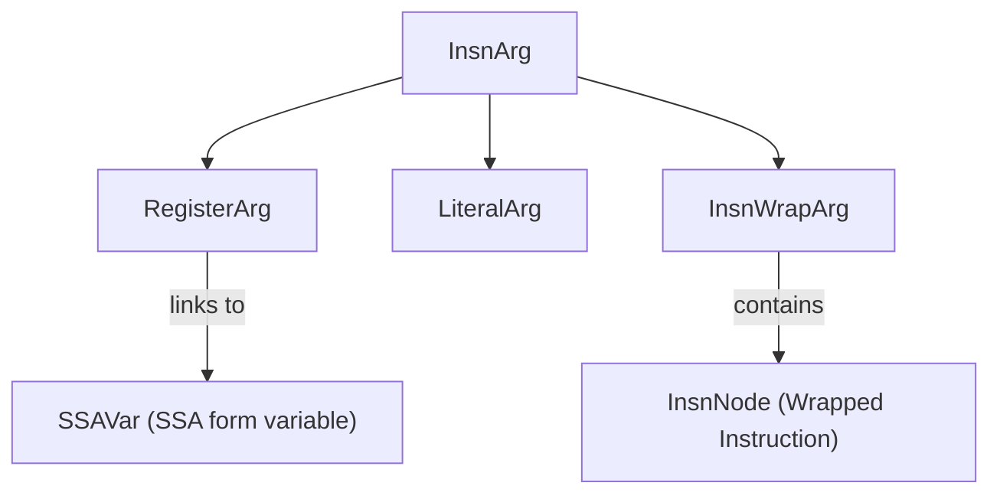
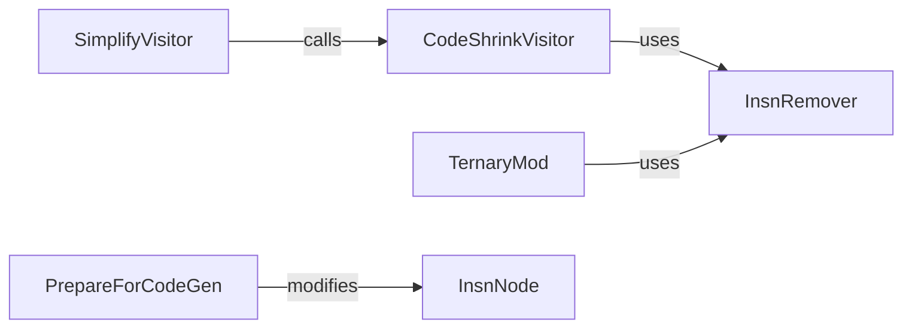

# Data Structures and Core Utilities

Relevant source files

The following files were used as context for generating this wiki page:

- [jadx-core/src/main/java/jadx/core/dex/instructions/args/InsnArg.java](https://github.com/skylot/jadx/blob/HEAD/jadx-core/src/main/java/jadx/core/dex/instructions/args/InsnArg.java)
- [jadx-core/src/main/java/jadx/core/dex/instructions/args/InsnWrapArg.java](https://github.com/skylot/jadx/blob/HEAD/jadx-core/src/main/java/jadx/core/dex/instructions/args/InsnWrapArg.java)
- [jadx-core/src/main/java/jadx/core/dex/nodes/InsnNode.java](https://github.com/skylot/jadx/blob/HEAD/jadx-core/src/main/java/jadx/core/dex/nodes/InsnNode.java)
- [jadx-core/src/main/java/jadx/core/dex/visitors/ConstInlineVisitor.java](https://github.com/skylot/jadx/blob/HEAD/jadx-core/src/main/java/jadx/core/dex/visitors/ConstInlineVisitor.java)
- [jadx-core/src/main/java/jadx/core/dex/visitors/PrepareForCodeGen.java](https://github.com/skylot/jadx/blob/HEAD/jadx-core/src/main/java/jadx/core/dex/visitors/PrepareForCodeGen.java)
- [jadx-core/src/main/java/jadx/core/dex/visitors/SimplifyVisitor.java](https://github.com/skylot/jadx/blob/HEAD/jadx-core/src/main/java/jadx/core/dex/visitors/SimplifyVisitor.java)
- [jadx-core/src/main/java/jadx/core/dex/visitors/regions/TernaryMod.java](https://github.com/skylot/jadx/blob/HEAD/jadx-core/src/main/java/jadx/core/dex/visitors/regions/TernaryMod.java)
- [jadx-core/src/main/java/jadx/core/dex/visitors/shrink/CodeShrinkVisitor.java](https://github.com/skylot/jadx/blob/HEAD/jadx-core/src/main/java/jadx/core/dex/visitors/shrink/CodeShrinkVisitor.java)
- [jadx-core/src/main/java/jadx/core/utils/DebugChecks.java](https://github.com/skylot/jadx/blob/HEAD/jadx-core/src/main/java/jadx/core/utils/DebugChecks.java)
- [jadx-core/src/main/java/jadx/core/utils/ImmutableList.java](https://github.com/skylot/jadx/blob/HEAD/jadx-core/src/main/java/jadx/core/utils/ImmutableList.java)
- [jadx-core/src/main/java/jadx/core/utils/InsnRemover.java](https://github.com/skylot/jadx/blob/HEAD/jadx-core/src/main/java/jadx/core/utils/InsnRemover.java)
- [jadx-core/src/main/java/jadx/core/utils/Utils.java](https://github.com/skylot/jadx/blob/HEAD/jadx-core/src/main/java/jadx/core/utils/Utils.java)
- [jadx-core/src/test/java/jadx/core/utils/ImmutableListTest.java](https://github.com/skylot/jadx/blob/HEAD/jadx-core/src/test/java/jadx/core/utils/ImmutableListTest.java)
- [jadx-core/src/test/java/jadx/tests/integration/conditions/TestConditions14.java](https://github.com/skylot/jadx/blob/HEAD/jadx-core/src/test/java/jadx/tests/integration/conditions/TestConditions14.java)
- [jadx-core/src/test/java/jadx/tests/integration/variables/TestVariables8.java](https://github.com/skylot/jadx/blob/HEAD/jadx-core/src/test/java/jadx/tests/integration/variables/TestVariables8.java)
- [jadx-core/src/test/smali/variables/TestVariables8.smali](https://github.com/skylot/jadx/blob/HEAD/jadx-core/src/test/smali/variables/TestVariables8.smali)

This page documents the fundamental data structures and utility classes used throughout the JADX decompiler. These structures form the foundation of the intermediate representation (IR) and provide essential services like metadata management, instruction representation, and caching.

## Overview

JADX organizes decompilation data into several primary categories:

1.  **Node Structures**: Represent the hierarchical program elements (classes, methods, fields, instructions).
2.  **Instruction Representation**: The low-level IR consisting of operation nodes and their arguments.
3.  **Info Classes**: Immutable metadata used for identity and deduplication.
4.  **Utilities**: Core services for caching, file handling, and common operations.

The system is designed to separate mutable processing state (stored in Node classes) from immutable identity (stored in Info classes), allowing for efficient memory usage through deduplication and a multi-tier caching system.

## Node Hierarchy

The node hierarchy represents the structure of decompiled programs. All nodes extend from base classes that provide common functionality for attributes and processing state.

### Primary Node Types

The relationship between the major structural nodes is illustrated below:

| Node Class | Level | Responsibility |
| :--- | :--- | :--- |
| `RootNode` | Global | Central coordinator; owns all classes and global registries [jadx-core/src/main/java/jadx/core/dex/nodes/RootNode.java:38](https://github.com/skylot/jadx/blob/HEAD/jadx-core/src/main/java/jadx/core/dex/nodes/RootNode.java#L38). |
| `ClassNode` | Class | Represents a class/interface; contains fields and methods [jadx-core/src/main/java/jadx/core/dex/nodes/ClassNode.java:37](https://github.com/skylot/jadx/blob/HEAD/jadx-core/src/main/java/jadx/core/dex/nodes/ClassNode.java#L37). |
| `FieldNode` | Member | Represents a class field, its type, and initial value [jadx-core/src/main/java/jadx/core/dex/nodes/FieldNode.java:38](https://github.com/skylot/jadx/blob/HEAD/jadx-core/src/main/java/jadx/core/dex/nodes/FieldNode.java#L38). |
| `MethodNode` | Member | Represents a method, its instructions, CFG, and SSA variables [jadx-core/src/main/java/jadx/core/dex/nodes/MethodNode.java:37](https://github.com/skylot/jadx/blob/HEAD/jadx-core/src/main/java/jadx/core/dex/nodes/MethodNode.java#L37). |
| `BlockNode` | Logic | A basic block containing a sequential list of `InsnNode`s [jadx-core/src/main/java/jadx/core/dex/nodes/BlockNode.java:35](https://github.com/skylot/jadx/blob/HEAD/jadx-core/src/main/java/jadx/core/dex/nodes/BlockNode.java#L35). |
| `InsnNode` | Atomic | The base class for all intermediate representation instructions [jadx-core/src/main/java/jadx/core/dex/nodes/InsnNode.java:28](https://github.com/skylot/jadx/blob/HEAD/jadx-core/src/main/java/jadx/core/dex/nodes/InsnNode.java#L28). |

**Sources**: [jadx-core/src/main/java/jadx/core/dex/nodes/InsnNode.java:28-32](https://github.com/skylot/jadx/blob/HEAD/jadx-core/src/main/java/jadx/core/dex/nodes/InsnNode.java#L28-L32), [jadx-core/src/main/java/jadx/core/dex/nodes/MethodNode.java:37](https://github.com/skylot/jadx/blob/HEAD/jadx-core/src/main/java/jadx/core/dex/nodes/MethodNode.java#L37), [jadx-core/src/main/java/jadx/core/dex/nodes/BlockNode.java:35](https://github.com/skylot/jadx/blob/HEAD/jadx-core/src/main/java/jadx/core/dex/nodes/BlockNode.java#L35)

### Attribute System

Most structural nodes in JADX inherit from `LineAttrNode` or `AttrNode`, which provide a flexible mechanism for attaching metadata (flags and attributes) without modifying class schemas.

*   **AFlag (Flags)**: Boolean markers used to signal state or requirements (e.g., `AFlag.DONT_GENERATE` [jadx-core/src/main/java/jadx/core/dex/nodes/InsnNode.java:129](https://github.com/skylot/jadx/blob/HEAD/jadx-core/src/main/java/jadx/core/dex/nodes/InsnNode.java#L129), `AFlag.REQUEST_CODE_SHRINK` [jadx-core/src/main/java/jadx/core/dex/visitors/SimplifyVisitor.java:75-77](https://github.com/skylot/jadx/blob/HEAD/jadx-core/src/main/java/jadx/core/dex/visitors/SimplifyVisitor.java#L75-L77)).
*   **AType (Attributes)**: Complex objects associated with specific `AType` keys (e.g., `AType.PHI_LIST` [jadx-core/src/main/java/jadx/core/utils/InsnRemover.java:14](https://github.com/skylot/jadx/blob/HEAD/jadx-core/src/main/java/jadx/core/utils/InsnRemover.java#L14)).

**Sources**: [jadx-core/src/main/java/jadx/core/dex/nodes/InsnNode.java:14-16](https://github.com/skylot/jadx/blob/HEAD/jadx-core/src/main/java/jadx/core/dex/nodes/InsnNode.java#L14-L16), [jadx-core/src/main/java/jadx/core/dex/visitors/SimplifyVisitor.java:75-77](https://github.com/skylot/jadx/blob/HEAD/jadx-core/src/main/java/jadx/core/dex/visitors/SimplifyVisitor.java#L75-L77), [jadx-core/src/main/java/jadx/core/utils/InsnRemover.java:12-14](https://github.com/skylot/jadx/blob/HEAD/jadx-core/src/main/java/jadx/core/utils/InsnRemover.java#L12-L14)

## Instruction Representation

Instructions are represented through a hierarchy of `InsnNode` subclasses. Each instruction consists of an `InsnType`, an optional result `RegisterArg`, and a list of `InsnArg` inputs.

### InsnNode Structure

The `InsnNode` class [jadx-core/src/main/java/jadx/core/dex/nodes/InsnNode.java:28-33](https://github.com/skylot/jadx/blob/HEAD/jadx-core/src/main/java/jadx/core/dex/nodes/InsnNode.java#L28-L33) acts as the container for:
*   `insnType`: The operation type (e.g., `ARITH`, `INVOKE`, `RETURN`) [jadx-core/src/main/java/jadx/core/dex/nodes/InsnNode.java:29](https://github.com/skylot/jadx/blob/HEAD/jadx-core/src/main/java/jadx/core/dex/nodes/InsnNode.java#L29).
*   `result`: A `RegisterArg` representing the variable receiving the output [jadx-core/src/main/java/jadx/core/dex/nodes/InsnNode.java:31](https://github.com/skylot/jadx/blob/HEAD/jadx-core/src/main/java/jadx/core/dex/nodes/InsnNode.java#L31).
*   `arguments`: A `List<InsnArg>` representing the inputs to the operation [jadx-core/src/main/java/jadx/core/dex/nodes/InsnNode.java:32](https://github.com/skylot/jadx/blob/HEAD/jadx-core/src/main/java/jadx/core/dex/nodes/InsnNode.java#L32).

### Argument Hierarchy

Inputs to instructions are represented by the `InsnArg` hierarchy:

*   **RegisterArg**: Represents a register or variable, linked to an `SSAVar` [jadx-core/src/main/java/jadx/core/dex/nodes/InsnNode.java:77-84](https://github.com/skylot/jadx/blob/HEAD/jadx-core/src/main/java/jadx/core/dex/nodes/InsnNode.java#L77-L84).
*   **LiteralArg**: Represents constant values (numbers, null) [jadx-core/src/main/java/jadx/core/dex/instructions/args/InsnArg.java:61-67](https://github.com/skylot/jadx/blob/HEAD/jadx-core/src/main/java/jadx/core/dex/instructions/args/InsnArg.java#L61-L67).
*   **InsnWrapArg**: Enables nested expressions by wrapping an instruction as an argument [jadx-core/src/main/java/jadx/core/dex/instructions/args/InsnWrapArg.java:11-22](https://github.com/skylot/jadx/blob/HEAD/jadx-core/src/main/java/jadx/core/dex/instructions/args/InsnWrapArg.java#L11-L22).

For details on instruction types and wrapping logic, see [Instruction Representation](39_8.1-instruction-representation.md).

**Sources**: [jadx-core/src/main/java/jadx/core/dex/nodes/InsnNode.java:35-46](https://github.com/skylot/jadx/blob/HEAD/jadx-core/src/main/java/jadx/core/dex/nodes/InsnNode.java#L35-L46), [jadx-core/src/main/java/jadx/core/dex/instructions/args/InsnArg.java:23-28](https://github.com/skylot/jadx/blob/HEAD/jadx-core/src/main/java/jadx/core/dex/instructions/args/InsnArg.java#L23-L28), [jadx-core/src/main/java/jadx/core/dex/instructions/args/InsnWrapArg.java:11-22](https://github.com/skylot/jadx/blob/HEAD/jadx-core/src/main/java/jadx/core/dex/instructions/args/InsnWrapArg.java#L11-L22)

## Info Classes and Metadata

Metadata for classes, methods, and fields is stored in "Info" classes. These are immutable and deduplicated to ensure that comparisons can be performed using reference equality.

| Class | Purpose |
| :--- | :--- |
| `ClassInfo` | Stores class name, package, and parent class info [jadx-core/src/main/java/jadx/core/dex/info/ClassInfo.java:15](https://github.com/skylot/jadx/blob/HEAD/jadx-core/src/main/java/jadx/core/dex/info/ClassInfo.java#L15). |
| `MethodInfo` | Stores method name, declaration class, and signature [jadx-core/src/main/java/jadx/core/dex/info/MethodInfo.java:17](https://github.com/skylot/jadx/blob/HEAD/jadx-core/src/main/java/jadx/core/dex/info/MethodInfo.java#L17). |
| `FieldInfo` | Stores field name, declaration class, and type [jadx-core/src/main/java/jadx/core/dex/info/FieldInfo.java:16](https://github.com/skylot/jadx/blob/HEAD/jadx-core/src/main/java/jadx/core/dex/info/FieldInfo.java#L16). |

These objects are managed by `InfoStorage` within the `RootNode`. For example, `MethodInfo.fromDetails` is used to create or retrieve a canonical method reference [jadx-core/src/main/java/jadx/core/dex/visitors/SimplifyVisitor.java:56-62](https://github.com/skylot/jadx/blob/HEAD/jadx-core/src/main/java/jadx/core/dex/visitors/SimplifyVisitor.java#L56-L62).

For details on the aliasing system and identifier generation, see [Info Classes and Metadata](40_8.2-info-classes-and-metadata.md).

**Sources**: [jadx-core/src/main/java/jadx/core/dex/visitors/SimplifyVisitor.java:15-17](https://github.com/skylot/jadx/blob/HEAD/jadx-core/src/main/java/jadx/core/dex/visitors/SimplifyVisitor.java#L15-L17), [jadx-core/src/main/java/jadx/core/dex/visitors/SimplifyVisitor.java:56-62](https://github.com/skylot/jadx/blob/HEAD/jadx-core/src/main/java/jadx/core/dex/visitors/SimplifyVisitor.java#L56-L62)

## Caching System

JADX uses a multi-tier caching architecture to balance memory usage and performance.

*   **InMemoryCodeCache**: Stores decompiled code in RAM for maximum speed.
*   **DiskCodeCache**: Persists decompiled code to disk to reduce RAM pressure.

The system handles node unloading, where the IR for a method or class is cleared from memory after processing, leaving only the cached final code.

For details on cache modes and unloading strategies, see [Caching System](41_8.3-caching-system.md).

## Core Utilities

JADX includes several specialized utility classes for common decompilation tasks:

### Instruction Manipulation and Optimization

*   **InsnRemover**: Safely removes instructions while unbinding arguments and cleaning up SSA variables [jadx-core/src/main/java/jadx/core/utils/InsnRemover.java:34-51](https://github.com/skylot/jadx/blob/HEAD/jadx-core/src/main/java/jadx/core/utils/InsnRemover.java#L34-L51). It ensures that if a result is removed, the corresponding `SSAVar` is deleted if it has no remaining usage [jadx-core/src/main/java/jadx/core/utils/InsnRemover.java:135-140](https://github.com/skylot/jadx/blob/HEAD/jadx-core/src/main/java/jadx/core/utils/InsnRemover.java#L135-L140).
*   **SimplifyVisitor**: Performs instruction-level optimizations, such as converting `MOVE` to `CONST` or simplifying string constructors [jadx-core/src/main/java/jadx/core/dex/visitors/SimplifyVisitor.java:128-173](https://github.com/skylot/jadx/blob/HEAD/jadx-core/src/main/java/jadx/core/dex/visitors/SimplifyVisitor.java#L128-L173).
*   **CodeShrinkVisitor**: Inlines variables to make code smaller and more readable [jadx-core/src/main/java/jadx/core/dex/visitors/shrink/CodeShrinkVisitor.java:31-42](https://github.com/skylot/jadx/blob/HEAD/jadx-core/src/main/java/jadx/core/dex/visitors/shrink/CodeShrinkVisitor.java#L31-L42).
*   **ConstInlineVisitor**: Inlines constant registers directly into instructions [jadx-core/src/main/java/jadx/core/dex/visitors/ConstInlineVisitor.java:32-40](https://github.com/skylot/jadx/blob/HEAD/jadx-core/src/main/java/jadx/core/dex/visitors/ConstInlineVisitor.java#L32-L40).
*   **TernaryMod**: Transforms `if-else` regions into ternary operations [jadx-core/src/main/java/jadx/core/dex/visitors/regions/TernaryMod.java:29-46](https://github.com/skylot/jadx/blob/HEAD/jadx-core/src/main/java/jadx/core/dex/visitors/regions/TernaryMod.java#L29-L46).
*   **PrepareForCodeGen**: Performs final IR modifications just before code generation, such as removing redundant parenthesis or arithmetic simplification [jadx-core/src/main/java/jadx/core/dex/visitors/PrepareForCodeGen.java:51-60](https://github.com/skylot/jadx/blob/HEAD/jadx-core/src/main/java/jadx/core/dex/visitors/PrepareForCodeGen.java#L51-L60).

### General Purpose and Debugging
*   **Utils**: Contains string manipulation helpers (e.g., `smaliNameToJavaName` [jadx-core/src/main/java/jadx/core/utils/Utils.java:64](https://github.com/skylot/jadx/blob/HEAD/jadx-core/src/main/java/jadx/core/utils/Utils.java#L64)) and general purpose collection utilities like `ImmutableList` [jadx-core/src/main/java/jadx/core/utils/ImmutableList.java:22](https://github.com/skylot/jadx/blob/HEAD/jadx-core/src/main/java/jadx/core/utils/ImmutableList.java#L22).
*   **DebugChecks**: Verifies IR consistency, such as ensuring SSA variables are correctly linked to their instructions [jadx-core/src/main/java/jadx/core/utils/DebugChecks.java:31-59](https://github.com/skylot/jadx/blob/HEAD/jadx-core/src/main/java/jadx/core/utils/DebugChecks.java#L31-L59). It is typically used in tests to catch regression errors in visitor passes [jadx-core/src/main/java/jadx/core/utils/DebugChecks.java:38-49](https://github.com/skylot/jadx/blob/HEAD/jadx-core/src/main/java/jadx/core/utils/DebugChecks.java#L38-L49).

For details on the custom ZIP parser and path traversal protection, see [ZIP and File Utilities](42_8.4-zip-and-file-utilities.md).

**Sources**: [jadx-core/src/main/java/jadx/core/utils/InsnRemover.java:34-51](https://github.com/skylot/jadx/blob/HEAD/jadx-core/src/main/java/jadx/core/utils/InsnRemover.java#L34-L51), [jadx-core/src/main/java/jadx/core/dex/visitors/SimplifyVisitor.java:128-173](https://github.com/skylot/jadx/blob/HEAD/jadx-core/src/main/java/jadx/core/dex/visitors/SimplifyVisitor.java#L128-L173), [jadx-core/src/main/java/jadx/core/dex/visitors/shrink/CodeShrinkVisitor.java:31-42](https://github.com/skylot/jadx/blob/HEAD/jadx-core/src/main/java/jadx/core/dex/visitors/shrink/CodeShrinkVisitor.java#L31-L42), [jadx-core/src/main/java/jadx/core/utils/DebugChecks.java:31-59](https://github.com/skylot/jadx/blob/HEAD/jadx-core/src/main/java/jadx/core/utils/DebugChecks.java#L31-L59), [jadx-core/src/main/java/jadx/core/utils/Utils.java:64-109](https://github.com/skylot/jadx/blob/HEAD/jadx-core/src/main/java/jadx/core/utils/Utils.java#L64-L109), [jadx-core/src/main/java/jadx/core/dex/visitors/PrepareForCodeGen.java:51-60](https://github.com/skylot/jadx/blob/HEAD/jadx-core/src/main/java/jadx/core/dex/visitors/PrepareForCodeGen.java#L51-L60)

## Detailed Sub-Pages

*   [Instruction Representation](39_8.1-instruction-representation.md) — Detailed breakdown of `InsnNode` and the argument system.
*   [Info Classes and Metadata](40_8.2-info-classes-and-metadata.md) — Deep dive into `ClassInfo`, `MethodInfo`, and the deduplication cache.
*   [Caching System](41_8.3-caching-system.md) — Technical details of the `ICodeCache` implementations and memory management.
*   [ZIP and File Utilities](42_8.4-zip-and-file-utilities.md) — Documentation for `jadx-zip` and core filesystem helpers.3d:T56bf