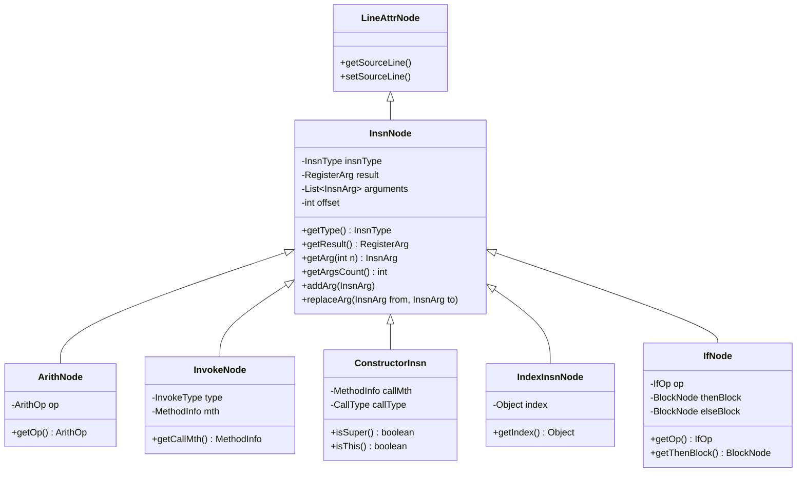
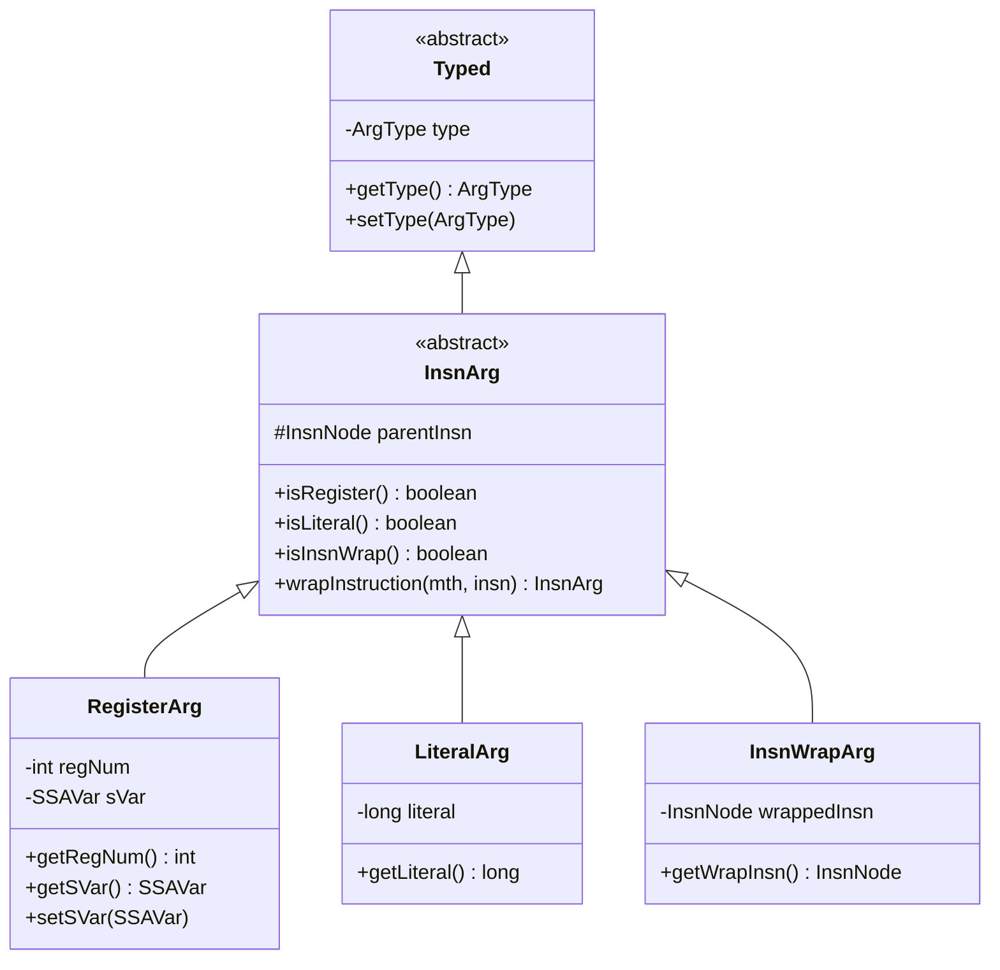
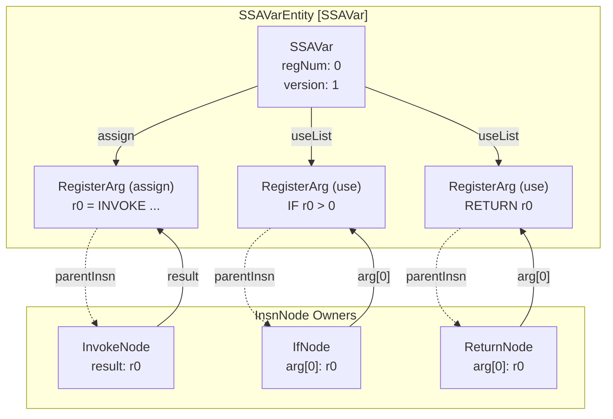

# Instruction Representation

<details>
<summary>Relevant source files</summary>

The following files were used as context for generating this wiki page:

- [jadx-core/src/main/java/jadx/core/dex/attributes/nodes/LineAttrNode.java](https://github.com/skylot/jadx/blob/HEAD/jadx-core/src/main/java/jadx/core/dex/attributes/nodes/LineAttrNode.java)
- [jadx-core/src/main/java/jadx/core/dex/instructions/ConstClassNode.java](https://github.com/skylot/jadx/blob/HEAD/jadx-core/src/main/java/jadx/core/dex/instructions/ConstClassNode.java)
- [jadx-core/src/main/java/jadx/core/dex/instructions/ConstStringNode.java](https://github.com/skylot/jadx/blob/HEAD/jadx-core/src/main/java/jadx/core/dex/instructions/ConstStringNode.java)
- [jadx-core/src/main/java/jadx/core/dex/instructions/GotoNode.java](https://github.com/skylot/jadx/blob/HEAD/jadx-core/src/main/java/jadx/core/dex/instructions/GotoNode.java)
- [jadx-core/src/main/java/jadx/core/dex/instructions/IfNode.java](https://github.com/skylot/jadx/blob/HEAD/jadx-core/src/main/java/jadx/core/dex/instructions/IfNode.java)
- [jadx-core/src/main/java/jadx/core/dex/instructions/IndexInsnNode.java](https://github.com/skylot/jadx/blob/HEAD/jadx-core/src/main/java/jadx/core/dex/instructions/IndexInsnNode.java)
- [jadx-core/src/main/java/jadx/core/dex/instructions/TargetInsnNode.java](https://github.com/skylot/jadx/blob/HEAD/jadx-core/src/main/java/jadx/core/dex/instructions/TargetInsnNode.java)
- [jadx-core/src/main/java/jadx/core/dex/instructions/args/InsnArg.java](https://github.com/skylot/jadx/blob/HEAD/jadx-core/src/main/java/jadx/core/dex/instructions/args/InsnArg.java)
- [jadx-core/src/main/java/jadx/core/dex/instructions/args/InsnWrapArg.java](https://github.com/skylot/jadx/blob/HEAD/jadx-core/src/main/java/jadx/core/dex/instructions/args/InsnWrapArg.java)
- [jadx-core/src/main/java/jadx/core/dex/instructions/args/RegisterArg.java](https://github.com/skylot/jadx/blob/HEAD/jadx-core/src/main/java/jadx/core/dex/instructions/args/RegisterArg.java)
- [jadx-core/src/main/java/jadx/core/dex/nodes/InsnNode.java](https://github.com/skylot/jadx/blob/HEAD/jadx-core/src/main/java/jadx/core/dex/nodes/InsnNode.java)
- [jadx-core/src/main/java/jadx/core/dex/regions/Region.java](https://github.com/skylot/jadx/blob/HEAD/jadx-core/src/main/java/jadx/core/dex/regions/Region.java)
- [jadx-core/src/main/java/jadx/core/dex/visitors/ConstInlineVisitor.java](https://github.com/skylot/jadx/blob/HEAD/jadx-core/src/main/java/jadx/core/dex/visitors/ConstInlineVisitor.java)
- [jadx-core/src/main/java/jadx/core/dex/visitors/PrepareForCodeGen.java](https://github.com/skylot/jadx/blob/HEAD/jadx-core/src/main/java/jadx/core/dex/visitors/PrepareForCodeGen.java)
- [jadx-core/src/main/java/jadx/core/dex/visitors/SimplifyVisitor.java](https://github.com/skylot/jadx/blob/HEAD/jadx-core/src/main/java/jadx/core/dex/visitors/SimplifyVisitor.java)
- [jadx-core/src/main/java/jadx/core/dex/visitors/regions/CheckRegions.java](https://github.com/skylot/jadx/blob/HEAD/jadx-core/src/main/java/jadx/core/dex/visitors/regions/CheckRegions.java)
- [jadx-core/src/main/java/jadx/core/dex/visitors/regions/CleanRegions.java](https://github.com/skylot/jadx/blob/HEAD/jadx-core/src/main/java/jadx/core/dex/visitors/regions/CleanRegions.java)
- [jadx-core/src/main/java/jadx/core/dex/visitors/regions/IfRegionVisitor.java](https://github.com/skylot/jadx/blob/HEAD/jadx-core/src/main/java/jadx/core/dex/visitors/regions/IfRegionVisitor.java)
- [jadx-core/src/main/java/jadx/core/dex/visitors/regions/LoopRegionVisitor.java](https://github.com/skylot/jadx/blob/HEAD/jadx-core/src/main/java/jadx/core/dex/visitors/regions/LoopRegionVisitor.java)
- [jadx-core/src/main/java/jadx/core/dex/visitors/regions/ProcessTryCatchRegions.java](https://github.com/skylot/jadx/blob/HEAD/jadx-core/src/main/java/jadx/core/dex/visitors/regions/ProcessTryCatchRegions.java)
- [jadx-core/src/main/java/jadx/core/dex/visitors/regions/RegionMakerVisitor.java](https://github.com/skylot/jadx/blob/HEAD/jadx-core/src/main/java/jadx/core/dex/visitors/regions/RegionMakerVisitor.java)
- [jadx-core/src/main/java/jadx/core/dex/visitors/regions/TernaryMod.java](https://github.com/skylot/jadx/blob/HEAD/jadx-core/src/main/java/jadx/core/dex/visitors/regions/TernaryMod.java)
- [jadx-core/src/main/java/jadx/core/dex/visitors/shrink/CodeShrinkVisitor.java](https://github.com/skylot/jadx/blob/HEAD/jadx-core/src/main/java/jadx/core/dex/visitors/shrink/CodeShrinkVisitor.java)
- [jadx-core/src/main/java/jadx/core/dex/visitors/ssa/LiveVarAnalysis.java](https://github.com/skylot/jadx/blob/HEAD/jadx-core/src/main/java/jadx/core/dex/visitors/ssa/LiveVarAnalysis.java)
- [jadx-core/src/main/java/jadx/core/dex/visitors/ssa/RenameState.java](https://github.com/skylot/jadx/blob/HEAD/jadx-core/src/main/java/jadx/core/dex/visitors/ssa/RenameState.java)
- [jadx-core/src/main/java/jadx/core/dex/visitors/ssa/SSATransform.java](https://github.com/skylot/jadx/blob/HEAD/jadx-core/src/main/java/jadx/core/dex/visitors/ssa/SSATransform.java)
- [jadx-core/src/main/java/jadx/core/utils/DebugChecks.java](https://github.com/skylot/jadx/blob/HEAD/jadx-core/src/main/java/jadx/core/utils/DebugChecks.java)
- [jadx-core/src/main/java/jadx/core/utils/InsnRemover.java](https://github.com/skylot/jadx/blob/HEAD/jadx-core/src/main/java/jadx/core/utils/InsnRemover.java)
- [jadx-core/src/main/java/jadx/core/utils/RegionUtils.java](https://github.com/skylot/jadx/blob/HEAD/jadx-core/src/main/java/jadx/core/utils/RegionUtils.java)
- [jadx-core/src/test/java/jadx/tests/integration/arith/TestFieldIncrement.java](https://github.com/skylot/jadx/blob/HEAD/jadx-core/src/test/java/jadx/tests/integration/arith/TestFieldIncrement.java)
- [jadx-core/src/test/java/jadx/tests/integration/arith/TestFieldIncrement3.java](https://github.com/skylot/jadx/blob/HEAD/jadx-core/src/test/java/jadx/tests/integration/arith/TestFieldIncrement3.java)
- [jadx-core/src/test/java/jadx/tests/integration/conditions/TestConditions14.java](https://github.com/skylot/jadx/blob/HEAD/jadx-core/src/test/java/jadx/tests/integration/conditions/TestConditions14.java)
- [jadx-core/src/test/java/jadx/tests/integration/debuginfo/TestVariablesNames.java](https://github.com/skylot/jadx/blob/HEAD/jadx-core/src/test/java/jadx/tests/integration/debuginfo/TestVariablesNames.java)
- [jadx-core/src/test/java/jadx/tests/integration/inner/TestInnerClassFakeSyntheticConstructor.java](https://github.com/skylot/jadx/blob/HEAD/jadx-core/src/test/java/jadx/tests/integration/inner/TestInnerClassFakeSyntheticConstructor.java)
- [jadx-core/src/test/java/jadx/tests/integration/inner/TestInnerClassSyntheticConstructor.java](https://github.com/skylot/jadx/blob/HEAD/jadx-core/src/test/java/jadx/tests/integration/inner/TestInnerClassSyntheticConstructor.java)
- [jadx-core/src/test/java/jadx/tests/integration/loops/TestEndlessLoop.java](https://github.com/skylot/jadx/blob/HEAD/jadx-core/src/test/java/jadx/tests/integration/loops/TestEndlessLoop.java)
- [jadx-core/src/test/java/jadx/tests/integration/switches/TestSwitchReturnFromCase2.java](https://github.com/skylot/jadx/blob/HEAD/jadx-core/src/test/java/jadx/tests/integration/switches/TestSwitchReturnFromCase2.java)
- [jadx-core/src/test/java/jadx/tests/integration/trycatch/TestTryCatchFinally8.java](https://github.com/skylot/jadx/blob/HEAD/jadx-core/src/test/java/jadx/tests/integration/trycatch/TestTryCatchFinally8.java)
- [jadx-core/src/test/java/jadx/tests/integration/types/TestFieldAccess.java](https://github.com/skylot/jadx/blob/HEAD/jadx-core/src/test/java/jadx/tests/integration/types/TestFieldAccess.java)
- [jadx-core/src/test/java/jadx/tests/integration/variables/TestVariables7.java](https://github.com/skylot/jadx/blob/HEAD/jadx-core/src/test/java/jadx/tests/integration/variables/TestVariables7.java)
- [jadx-core/src/test/java/jadx/tests/integration/variables/TestVariables8.java](https://github.com/skylot/jadx/blob/HEAD/jadx-core/src/test/java/jadx/tests/integration/variables/TestVariables8.java)
- [jadx-core/src/test/smali/inner/TestInnerClassFakeSyntheticConstructor.smali](https://github.com/skylot/jadx/blob/HEAD/jadx-core/src/test/smali/inner/TestInnerClassFakeSyntheticConstructor.smali)
- [jadx-core/src/test/smali/variables/TestVariables7.smali](https://github.com/skylot/jadx/blob/HEAD/jadx-core/src/test/smali/variables/TestVariables7.smali)
- [jadx-core/src/test/smali/variables/TestVariables8.smali](https://github.com/skylot/jadx/blob/HEAD/jadx-core/src/test/smali/variables/TestVariables8.smali)

</details>


This page documents Jadx's intermediate representation (IR) for instructions, including the `InsnNode` hierarchy, instruction arguments (`InsnArg`), SSA variables (`SSAVar`), and how these components form expression trees during decompilation.

## Overview

Jadx represents DEX bytecode instructions as an intermediate representation (IR) that preserves semantic information while enabling transformations. Each instruction is represented by an `InsnNode` object that contains:

- An instruction type (from the `InsnType` enum) [jadx-core/src/main/java/jadx/core/dex/nodes/InsnNode.java:29](https://github.com/skylot/jadx/blob/HEAD/jadx-core/src/main/java/jadx/core/dex/nodes/InsnNode.java#L29)
- Zero or more arguments (`InsnArg` objects) [jadx-core/src/main/java/jadx/core/dex/nodes/InsnNode.java:32](https://github.com/skylot/jadx/blob/HEAD/jadx-core/src/main/java/jadx/core/dex/nodes/InsnNode.java#L32)
- An optional result register (`RegisterArg`) [jadx-core/src/main/java/jadx/core/dex/nodes/InsnNode.java:31](https://github.com/skylot/jadx/blob/HEAD/jadx-core/src/main/java/jadx/core/dex/nodes/InsnNode.java#L31)
- Metadata such as bytecode offset and source line number [jadx-core/src/main/java/jadx/core/dex/nodes/InsnNode.java:33](https://github.com/skylot/jadx/blob/HEAD/jadx-core/src/main/java/jadx/core/dex/nodes/InsnNode.java#L33)

The IR supports nested expressions through instruction wrapping, where one instruction can be an argument to another, forming expression trees.

**InsnNode Class Structure**



Sources: [jadx-core/src/main/java/jadx/core/dex/nodes/InsnNode.java:28-305](https://github.com/skylot/jadx/blob/HEAD/jadx-core/src/main/java/jadx/core/dex/nodes/InsnNode.java#L28-L305), [jadx-core/src/main/java/jadx/core/dex/instructions/IfNode.java:17-23](https://github.com/skylot/jadx/blob/HEAD/jadx-core/src/main/java/jadx/core/dex/instructions/IfNode.java#L17-L23), [jadx-core/src/main/java/jadx/core/dex/attributes/nodes/LineAttrNode.java:16](https://github.com/skylot/jadx/blob/HEAD/jadx-core/src/main/java/jadx/core/dex/attributes/nodes/LineAttrNode.java#L16)

## InsnNode: The Base Instruction Class

`InsnNode` is the base class for all instructions in Jadx's IR. It provides a flexible structure that can represent any DEX instruction while maintaining type safety through subclasses for specific instruction types.

### Core Components

Each `InsnNode` contains:

1.  **Instruction Type** (`InsnType`): An enum value identifying the operation (e.g., `MOVE`, `INVOKE`, `ARITH`, `IF`) [jadx-core/src/main/java/jadx/core/dex/nodes/InsnNode.java:86-88](https://github.com/skylot/jadx/blob/HEAD/jadx-core/src/main/java/jadx/core/dex/nodes/InsnNode.java#L86-L88)
2.  **Result Register** (`RegisterArg`): The destination register for the instruction's output [jadx-core/src/main/java/jadx/core/dex/nodes/InsnNode.java:54-63](https://github.com/skylot/jadx/blob/HEAD/jadx-core/src/main/java/jadx/core/dex/nodes/InsnNode.java#L54-L63)
3.  **Arguments** (`List<InsnArg>`): Input operands to the instruction [jadx-core/src/main/java/jadx/core/dex/nodes/InsnNode.java:98-100](https://github.com/skylot/jadx/blob/HEAD/jadx-core/src/main/java/jadx/core/dex/nodes/InsnNode.java#L98-L100)
4.  **Offset** (`int`): The bytecode offset for debugging and metadata attachment [jadx-core/src/main/java/jadx/core/dex/nodes/InsnNode.java:190-196](https://github.com/skylot/jadx/blob/HEAD/jadx-core/src/main/java/jadx/core/dex/nodes/InsnNode.java#L190-L196)

### Key Operations

The `InsnNode` class provides methods for manipulating instruction structure:

-   **Argument Manipulation**: `addArg(InsnArg)` adds an argument [jadx-core/src/main/java/jadx/core/dex/nodes/InsnNode.java:65-68](https://github.com/skylot/jadx/blob/HEAD/jadx-core/src/main/java/jadx/core/dex/nodes/InsnNode.java#L65-L68), while `replaceArg(InsnArg from, InsnArg to)` performs a recursive search to replace an argument even inside wrapped instructions [jadx-core/src/main/java/jadx/core/dex/nodes/InsnNode.java:132-146](https://github.com/skylot/jadx/blob/HEAD/jadx-core/src/main/java/jadx/core/dex/nodes/InsnNode.java#L132-L146).
-   **Register Tracking**: `getRegisterArgs(Collection)` recursively collects all register arguments [jadx-core/src/main/java/jadx/core/dex/nodes/InsnNode.java:198-206](https://github.com/skylot/jadx/blob/HEAD/jadx-core/src/main/java/jadx/core/dex/nodes/InsnNode.java#L198-L206).
-   **Reordering Logic**: `canReorder()` determines if the instruction can be safely moved during optimization passes [jadx-core/src/main/java/jadx/core/dex/nodes/InsnNode.java:244-286](https://github.com/skylot/jadx/blob/HEAD/jadx-core/src/main/java/jadx/core/dex/nodes/InsnNode.java#L244-L286).
-   **Instruction Visiting**: `visitInsns(Consumer<InsnNode>)` allows traversing the instruction and all its wrapped children [jadx-core/src/main/java/jadx/core/dex/nodes/InsnNode.java:300-307](https://github.com/skylot/jadx/blob/HEAD/jadx-core/src/main/java/jadx/core/dex/nodes/InsnNode.java#L300-L307).

### Specialized Instruction Subclasses

Specific instruction types extend `InsnNode` to add type-specific data:

-   **`ArithNode`**: Arithmetic operations with an `ArithOp` (ADD, SUB, MUL, etc.) [jadx-core/src/main/java/jadx/core/dex/instructions/ArithNode.java:1](https://github.com/skylot/jadx/blob/HEAD/jadx-core/src/main/java/jadx/core/dex/instructions/ArithNode.java#L1).
-   **`InvokeNode`**: Method invocations containing `MethodInfo` and `InvokeType` [jadx-core/src/main/java/jadx/core/dex/instructions/InvokeNode.java:12-15](https://github.com/skylot/jadx/blob/HEAD/jadx-core/src/main/java/jadx/core/dex/instructions/InvokeNode.java#L12-L15).
-   **`ConstructorInsn`**: Constructor calls, distinguishing between standard constructors, `super()`, and `this()` calls [jadx-core/src/main/java/jadx/core/dex/instructions/mods/ConstructorInsn.java:15-25](https://github.com/skylot/jadx/blob/HEAD/jadx-core/src/main/java/jadx/core/dex/instructions/mods/ConstructorInsn.java#L15-L25).
-   **`IndexInsnNode`**: Instructions with an index operand, such as field access (`SGET`/`SPUT`) or type operations (`CAST`/`CHECK_CAST`) [jadx-core/src/main/java/jadx/core/dex/instructions/IndexInsnNode.java:1](https://github.com/skylot/jadx/blob/HEAD/jadx-core/src/main/java/jadx/core/dex/instructions/IndexInsnNode.java#L1).
-   **`IfNode`**: Conditional branches with a comparison operator (`IfOp`) and links to `thenBlock` and `elseBlock` [jadx-core/src/main/java/jadx/core/dex/instructions/IfNode.java:17-23](https://github.com/skylot/jadx/blob/HEAD/jadx-core/src/main/java/jadx/core/dex/instructions/IfNode.java#L17-L23).
-   **`ConstStringNode`**, **`ConstClassNode`**: Specialized nodes for string and class constants [jadx-core/src/main/java/jadx/core/dex/instructions/ConstStringNode.java:1](https://github.com/skylot/jadx/blob/HEAD/jadx-core/src/main/java/jadx/core/dex/instructions/ConstStringNode.java#L1), [jadx-core/src/main/java/jadx/core/dex/instructions/ConstClassNode.java:1](https://github.com/skylot/jadx/blob/HEAD/jadx-core/src/main/java/jadx/core/dex/instructions/ConstClassNode.java#L1).

Sources: [jadx-core/src/main/java/jadx/core/dex/nodes/InsnNode.java:28-307](https://github.com/skylot/jadx/blob/HEAD/jadx-core/src/main/java/jadx/core/dex/nodes/InsnNode.java#L28-L307), [jadx-core/src/main/java/jadx/core/dex/instructions/IfNode.java:17-23](https://github.com/skylot/jadx/blob/HEAD/jadx-core/src/main/java/jadx/core/dex/instructions/IfNode.java#L17-L23), [jadx-core/src/main/java/jadx/core/dex/instructions/InvokeNode.java:12-15](https://github.com/skylot/jadx/blob/HEAD/jadx-core/src/main/java/jadx/core/dex/instructions/InvokeNode.java#L12-L15)

## Instruction Arguments

Instruction arguments are represented by the `InsnArg` class hierarchy. Arguments can be registers, literals, or nested instructions. The type system allows arguments to carry type information that gets refined during decompilation.

**InsnArg Type Hierarchy**



### RegisterArg

`RegisterArg` represents a register (variable) in the instruction. It contains:

-   **Register Number** (`regNum`): The physical register number from bytecode [jadx-core/src/main/java/jadx/core/dex/instructions/args/RegisterArg.java:17](https://github.com/skylot/jadx/blob/HEAD/jadx-core/src/main/java/jadx/core/dex/instructions/args/RegisterArg.java#L17).
-   **SSA Variable** (`sVar`): Link to the SSA variable representation [jadx-core/src/main/java/jadx/core/dex/instructions/args/RegisterArg.java:19](https://github.com/skylot/jadx/blob/HEAD/jadx-core/src/main/java/jadx/core/dex/instructions/args/RegisterArg.java#L19).
-   **Type Information**: The inferred or declared type of the register. It retrieves the type from the associated `SSAVar` if present [jadx-core/src/main/java/jadx/core/dex/instructions/args/RegisterArg.java:40-45](https://github.com/skylot/jadx/blob/HEAD/jadx-core/src/main/java/jadx/core/dex/instructions/args/RegisterArg.java#L40-L45).

Factory methods for creating `RegisterArg` instances:
```java
InsnArg.reg(int regNum, ArgType type);
InsnArg.typeImmutableReg(int regNum, ArgType type); // Prevents type changes via AFlag.IMMUTABLE_TYPE
```
Sources: [jadx-core/src/main/java/jadx/core/dex/instructions/args/InsnArg.java:30-59](https://github.com/skylot/jadx/blob/HEAD/jadx-core/src/main/java/jadx/core/dex/instructions/args/InsnArg.java#L30-L59), [jadx-core/src/main/java/jadx/core/dex/instructions/args/RegisterArg.java:13-252](https://github.com/skylot/jadx/blob/HEAD/jadx-core/src/main/java/jadx/core/dex/instructions/args/RegisterArg.java#L13-L252)

### LiteralArg

`LiteralArg` represents constant values in instructions. It stores:

-   **Literal Value** (`long`): The numeric constant [jadx-core/src/main/java/jadx/core/dex/instructions/args/LiteralArg.java:1](https://github.com/skylot/jadx/blob/HEAD/jadx-core/src/main/java/jadx/core/dex/instructions/args/LiteralArg.java#L1).
-   **Type**: The type of the literal (INT, LONG, BOOLEAN, etc.). It provides helpers like `isTrue()` and `isFalse()` for boolean literals [jadx-core/src/main/java/jadx/core/dex/instructions/args/InsnArg.java:236-250](https://github.com/skylot/jadx/blob/HEAD/jadx-core/src/main/java/jadx/core/dex/instructions/args/InsnArg.java#L236-L250).

Sources: [jadx-core/src/main/java/jadx/core/dex/instructions/args/InsnArg.java:61-67](https://github.com/skylot/jadx/blob/HEAD/jadx-core/src/main/java/jadx/core/dex/instructions/args/InsnArg.java#L61-L67), [jadx-core/src/main/java/jadx/core/dex/instructions/args/InsnArg.java:236-250](https://github.com/skylot/jadx/blob/HEAD/jadx-core/src/main/java/jadx/core/dex/instructions/args/InsnArg.java#L236-L250)

### InsnWrapArg

`InsnWrapArg` wraps another instruction as an argument, enabling nested expressions. This is fundamental to Jadx's expression tree representation. The wrapped instruction is marked with the `AFlag.WRAPPED` attribute [jadx-core/src/main/java/jadx/core/dex/instructions/args/InsnArg.java:70](https://github.com/skylot/jadx/blob/HEAD/jadx-core/src/main/java/jadx/core/dex/instructions/args/InsnArg.java#L70).

When creating wrapped arguments:
```java
InsnArg wrapArg = InsnArg.wrapArg(insn); // Static factory
arg.wrapInstruction(mth, insn);          // Wrap in-place and replace usage
```
Sources: [jadx-core/src/main/java/jadx/core/dex/instructions/args/InsnArg.java:69-72](https://github.com/skylot/jadx/blob/HEAD/jadx-core/src/main/java/jadx/core/dex/instructions/args/InsnArg.java#L69-L72), [jadx-core/src/main/java/jadx/core/dex/instructions/args/InsnArg.java:100-152](https://github.com/skylot/jadx/blob/HEAD/jadx-core/src/main/java/jadx/core/dex/instructions/args/InsnArg.java#L100-L152), [jadx-core/src/main/java/jadx/core/dex/instructions/args/InsnWrapArg.java:11-22](https://github.com/skylot/jadx/blob/HEAD/jadx-core/src/main/java/jadx/core/dex/instructions/args/InsnWrapArg.java#L11-L22)

## SSA Variables

Jadx uses Static Single Assignment (SSA) form during type inference and optimization. The `SSAVar` class links all uses of a logical variable across different register assignments. The `SSATransform` pass is responsible for calculating these variables and placing `PhiInsn` nodes at merge points [jadx-core/src/main/java/jadx/core/dex/visitors/ssa/SSATransform.java:32-37](https://github.com/skylot/jadx/blob/HEAD/jadx-core/src/main/java/jadx/core/dex/visitors/ssa/SSATransform.java#L32-L37).

**SSAVar Structure and Relationships**



### SSAVar Components

An `SSAVar` maintains:

-   **Register Number** (`regNum`): The physical register this variable occupies.
-   **Assign Site** (`assign`): The `RegisterArg` where the variable is defined [jadx-core/src/main/java/jadx/core/dex/nodes/InsnNode.java:60](https://github.com/skylot/jadx/blob/HEAD/jadx-core/src/main/java/jadx/core/dex/nodes/InsnNode.java#L60).
-   **Use Sites** (`useList`): List of `RegisterArg` instances where the variable is read [jadx-core/src/main/java/jadx/core/dex/nodes/InsnNode.java:81](https://github.com/skylot/jadx/blob/HEAD/jadx-core/src/main/java/jadx/core/dex/nodes/InsnNode.java#L81).
-   **Type Information**: The inferred type for this SSA variable.

### SSA Operations

Key methods on `SSAVar` and related classes:

-   `ssaVar.use(RegisterArg arg)`: Adds a register usage to the SSA variable's use list [jadx-core/src/main/java/jadx/core/dex/nodes/InsnNode.java:81](https://github.com/skylot/jadx/blob/HEAD/jadx-core/src/main/java/jadx/core/dex/nodes/InsnNode.java#L81).
-   `ssaVar.setAssign(RegisterArg arg)`: Sets the primary definition site for the variable [jadx-core/src/main/java/jadx/core/dex/nodes/InsnNode.java:60](https://github.com/skylot/jadx/blob/HEAD/jadx-core/src/main/java/jadx/core/dex/nodes/InsnNode.java#L60).
-   **Variable Renaming**: `SSATransform.renameVariables` traverses the dominator tree to assign unique SSA versions to registers [jadx-core/src/main/java/jadx/core/dex/visitors/ssa/SSATransform.java:122-135](https://github.com/skylot/jadx/blob/HEAD/jadx-core/src/main/java/jadx/core/dex/visitors/ssa/SSATransform.java#L122-L135).

Sources: [jadx-core/src/main/java/jadx/core/dex/nodes/InsnNode.java:54-84](https://github.com/skylot/jadx/blob/HEAD/jadx-core/src/main/java/jadx/core/dex/nodes/InsnNode.java#L54-L84), [jadx-core/src/main/java/jadx/core/dex/visitors/ssa/SSATransform.java:122-135](https://github.com/skylot/jadx/blob/HEAD/jadx-core/src/main/java/jadx/core/dex/visitors/ssa/SSATransform.java#L122-L135)

## Instruction Wrapping and Expression Trees

One of Jadx's key features is converting flat bytecode into nested expression trees. This is accomplished through instruction wrapping.

### Wrapping Process

Instruction wrapping occurs in several visitor passes:

1.  **`CodeShrinkVisitor`**: Inlines variables to make code smaller by wrapping instructions into their use sites [jadx-core/src/main/java/jadx/core/dex/visitors/shrink/CodeShrinkVisitor.java:30-40](https://github.com/skylot/jadx/blob/HEAD/jadx-core/src/main/java/jadx/core/dex/visitors/shrink/CodeShrinkVisitor.java#L30-L40). It handles complex logic like checking if an instruction can be moved between blocks [jadx-core/src/main/java/jadx/core/dex/visitors/shrink/CodeShrinkVisitor.java:136-145](https://github.com/skylot/jadx/blob/HEAD/jadx-core/src/main/java/jadx/core/dex/visitors/shrink/CodeShrinkVisitor.java#L136-L145).
2.  **`SimplifyVisitor`**: Simplifies expressions (e.g., converting `MOVE` with literal to `CONST`) and may wrap/unwrap instructions [jadx-core/src/main/java/jadx/core/dex/visitors/SimplifyVisitor.java:109-126](https://github.com/skylot/jadx/blob/HEAD/jadx-core/src/main/java/jadx/core/dex/visitors/SimplifyVisitor.java#L109-L126), [jadx-core/src/main/java/jadx/core/dex/visitors/SimplifyVisitor.java:155-163](https://github.com/skylot/jadx/blob/HEAD/jadx-core/src/main/java/jadx/core/dex/visitors/SimplifyVisitor.java#L155-L163).
3.  **`TernaryMod`**: Converts 'if' regions into `TernaryInsn` by wrapping the branch results into a single expression [jadx-core/src/main/java/jadx/core/dex/visitors/regions/TernaryMod.java:118-128](https://github.com/skylot/jadx/blob/HEAD/jadx-core/src/main/java/jadx/core/dex/visitors/regions/TernaryMod.java#L118-L128).
4.  **`ConstInlineVisitor`**: Inlines constants directly into use sites, replacing `RegisterArg` with `LiteralArg` or wrapped constant instructions [jadx-core/src/main/java/jadx/core/dex/visitors/ConstInlineVisitor.java:109-116](https://github.com/skylot/jadx/blob/HEAD/jadx-core/src/main/java/jadx/core/dex/visitors/ConstInlineVisitor.java#L109-L116).
5.  **`PrepareForCodeGen`**: Finalizes the IR for code generation, replacing redundant moves with inner wrapped instructions [jadx-core/src/main/java/jadx/core/dex/visitors/PrepareForCodeGen.java:130-143](https://github.com/skylot/jadx/blob/HEAD/jadx-core/src/main/java/jadx/core/dex/visitors/PrepareForCodeGen.java#L130-L143).

### Wrapping Constraints

Not all instructions can be wrapped. The `canReorder()` method determines if an instruction is pure enough to wrap [jadx-core/src/main/java/jadx/core/dex/nodes/InsnNode.java:244-286](https://github.com/skylot/jadx/blob/HEAD/jadx-core/src/main/java/jadx/core/dex/nodes/InsnNode.java#L244-L286):

```java
public boolean canReorder() {
    // ...
    switch (getType()) {
        case CONST:
        case ARITH:
        case MOVE:
        case STR_CONCAT:
            return true;
        case SGET:
        case IGET:
            return false; // Not reorderable by default
        default:
            return false;
    }
}
```

Sources: [jadx-core/src/main/java/jadx/core/dex/nodes/InsnNode.java:244-286](https://github.com/skylot/jadx/blob/HEAD/jadx-core/src/main/java/jadx/core/dex/nodes/InsnNode.java#L244-L286), [jadx-core/src/main/java/jadx/core/dex/visitors/shrink/CodeShrinkVisitor.java:63-76](https://github.com/skylot/jadx/blob/HEAD/jadx-core/src/main/java/jadx/core/dex/visitors/shrink/CodeShrinkVisitor.java#L63-L76), [jadx-core/src/main/java/jadx/core/dex/visitors/SimplifyVisitor.java:109-126](https://github.com/skylot/jadx/blob/HEAD/jadx-core/src/main/java/jadx/core/dex/visitors/SimplifyVisitor.java#L109-L126), [jadx-core/src/main/java/jadx/core/dex/visitors/PrepareForCodeGen.java:130-143](https://github.com/skylot/jadx/blob/HEAD/jadx-core/src/main/java/jadx/core/dex/visitors/PrepareForCodeGen.java#L130-L143)

## Instruction Utilities

The codebase provides utility classes for manipulating and searching instructions:

-   **`InsnRemover`**: Provides logic for safely removing instructions while unbinding arguments and result SSA variables to maintain consistency [jadx-core/src/main/java/jadx/core/utils/InsnRemover.java:91-104](https://github.com/skylot/jadx/blob/HEAD/jadx-core/src/main/java/jadx/core/utils/InsnRemover.java#L91-L104).
-   **`RegionUtils`**: Provides methods to navigate and inspect instructions within high-level regions, such as `getFirstInsn` and `getLastInsn` [jadx-core/src/main/java/jadx/core/utils/RegionUtils.java:64-84](https://github.com/skylot/jadx/blob/HEAD/jadx-core/src/main/java/jadx/core/utils/RegionUtils.java#L64-L84), [jadx-core/src/main/java/jadx/core/utils/RegionUtils.java:170-190](https://github.com/skylot/jadx/blob/HEAD/jadx-core/src/main/java/jadx/core/utils/RegionUtils.java#L170-L190).
-   **`InsnList`**: A wrapper for instruction lists that provides safe indexing and replacement logic during visitor passes [jadx-core/src/main/java/jadx/core/dex/visitors/SimplifyVisitor.java:91-96](https://github.com/skylot/jadx/blob/HEAD/jadx-core/src/main/java/jadx/core/dex/visitors/SimplifyVisitor.java#L91-L96).

Sources: [jadx-core/src/main/java/jadx/core/utils/InsnRemover.java:1-180](https://github.com/skylot/jadx/blob/HEAD/jadx-core/src/main/java/jadx/core/utils/InsnRemover.java#L1-L180), [jadx-core/src/main/java/jadx/core/utils/RegionUtils.java:38-225](https://github.com/skylot/jadx/blob/HEAD/jadx-core/src/main/java/jadx/core/utils/RegionUtils.java#L38-L225), [jadx-core/src/main/java/jadx/core/dex/visitors/SimplifyVisitor.java:80-108](https://github.com/skylot/jadx/blob/HEAD/jadx-core/src/main/java/jadx/core/dex/visitors/SimplifyVisitor.java#L80-L108)