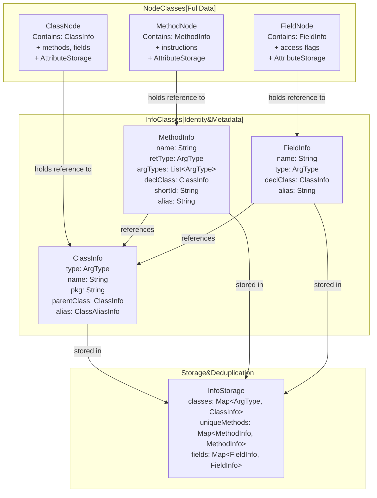
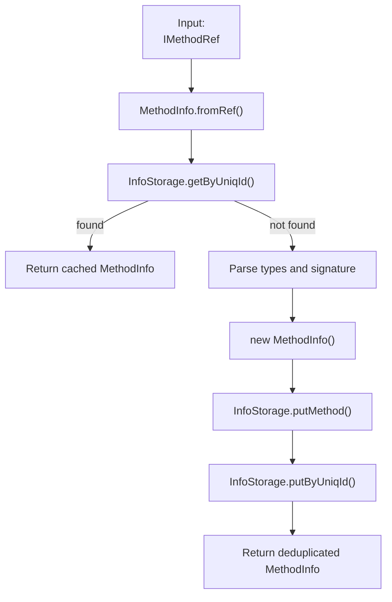
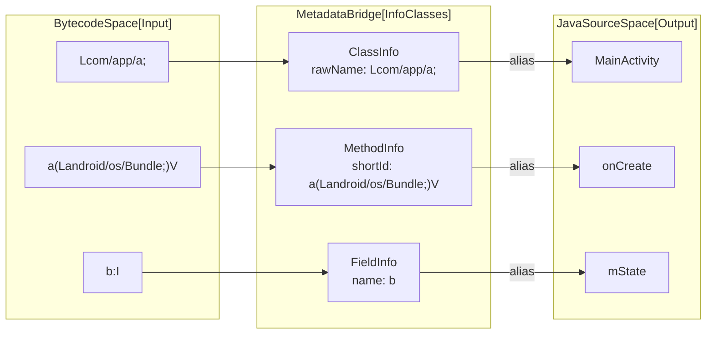

# Info Classes and Metadata

Relevant source files

The following files were used as context for generating this wiki page:

- [jadx-core/src/main/java/jadx/core/clsp/ClspGraph.java](https://github.com/skylot/jadx/blob/HEAD/jadx-core/src/main/java/jadx/core/clsp/ClspGraph.java)
- [jadx-core/src/main/java/jadx/core/deobf/DeobfPresets.java](https://github.com/skylot/jadx/blob/HEAD/jadx-core/src/main/java/jadx/core/deobf/DeobfPresets.java)
- [jadx-core/src/main/java/jadx/core/dex/attributes/AttrList.java](https://github.com/skylot/jadx/blob/HEAD/jadx-core/src/main/java/jadx/core/dex/attributes/AttrList.java)
- [jadx-core/src/main/java/jadx/core/dex/attributes/AttrNode.java](https://github.com/skylot/jadx/blob/HEAD/jadx-core/src/main/java/jadx/core/dex/attributes/AttrNode.java)
- [jadx-core/src/main/java/jadx/core/dex/attributes/AttributeStorage.java](https://github.com/skylot/jadx/blob/HEAD/jadx-core/src/main/java/jadx/core/dex/attributes/AttributeStorage.java)
- [jadx-core/src/main/java/jadx/core/dex/attributes/EmptyAttrStorage.java](https://github.com/skylot/jadx/blob/HEAD/jadx-core/src/main/java/jadx/core/dex/attributes/EmptyAttrStorage.java)
- [jadx-core/src/main/java/jadx/core/dex/attributes/nodes/MethodOverrideAttr.java](https://github.com/skylot/jadx/blob/HEAD/jadx-core/src/main/java/jadx/core/dex/attributes/nodes/MethodOverrideAttr.java)
- [jadx-core/src/main/java/jadx/core/dex/info/FieldInfo.java](https://github.com/skylot/jadx/blob/HEAD/jadx-core/src/main/java/jadx/core/dex/info/FieldInfo.java)
- [jadx-core/src/main/java/jadx/core/dex/info/MethodInfo.java](https://github.com/skylot/jadx/blob/HEAD/jadx-core/src/main/java/jadx/core/dex/info/MethodInfo.java)
- [jadx-core/src/main/java/jadx/core/dex/instructions/InvokeNode.java](https://github.com/skylot/jadx/blob/HEAD/jadx-core/src/main/java/jadx/core/dex/instructions/InvokeNode.java)
- [jadx-core/src/main/java/jadx/core/dex/instructions/mods/ConstructorInsn.java](https://github.com/skylot/jadx/blob/HEAD/jadx-core/src/main/java/jadx/core/dex/instructions/mods/ConstructorInsn.java)
- [jadx-core/src/main/java/jadx/core/dex/nodes/FieldNode.java](https://github.com/skylot/jadx/blob/HEAD/jadx-core/src/main/java/jadx/core/dex/nodes/FieldNode.java)
- [jadx-core/src/main/java/jadx/core/dex/nodes/utils/MethodUtils.java](https://github.com/skylot/jadx/blob/HEAD/jadx-core/src/main/java/jadx/core/dex/nodes/utils/MethodUtils.java)
- [jadx-core/src/main/java/jadx/core/dex/visitors/OverrideMethodVisitor.java](https://github.com/skylot/jadx/blob/HEAD/jadx-core/src/main/java/jadx/core/dex/visitors/OverrideMethodVisitor.java)
- [jadx-core/src/test/java/jadx/tests/integration/others/TestStringConstructor.java](https://github.com/skylot/jadx/blob/HEAD/jadx-core/src/test/java/jadx/tests/integration/others/TestStringConstructor.java)

This document describes the **Info classes** (`ClassInfo`, `MethodInfo`, `FieldInfo`), the **InfoStorage** system that manages metadata about classes, methods, and fields, and the classpath metadata system (`ClspGraph`). These lightweight identity objects serve as canonical references that are deduplicated and shared across the entire codebase.

---

## Purpose and Architecture

The Info classes provide **immutable, deduplicated identity objects** that represent:
- **ClassInfo**: A class's type, package, name, and parent class.
- **MethodInfo**: A method's signature including name, parameters, and return type.
- **FieldInfo**: A field's declaring class, name, and type.

These objects serve as **canonical keys** throughout JADX, ensuring that references to the same entity share the same identity object. This is critical for efficient lookups, comparison operations, and memory usage.

**Key distinction**: Info classes store **metadata and identity**, while Node classes (`ClassNode`, `MethodNode`, `FieldNode`) store **full data and processing state**. Node classes inherit from `AttrNode` to store additional metadata through the `AttributeStorage` system.

Sources: [jadx-core/src/main/java/jadx/core/dex/info/MethodInfo.java:15-25](https://github.com/skylot/jadx/blob/HEAD/jadx-core/src/main/java/jadx/core/dex/info/MethodInfo.java#L15-L25), [jadx-core/src/main/java/jadx/core/dex/info/FieldInfo.java:11-17](https://github.com/skylot/jadx/blob/HEAD/jadx-core/src/main/java/jadx/core/dex/info/FieldInfo.java#L11-L17), [jadx-core/src/main/java/jadx/core/dex/nodes/FieldNode.java:15-19](https://github.com/skylot/jadx/blob/HEAD/jadx-core/src/main/java/jadx/core/dex/nodes/FieldNode.java#L15-L19), [jadx-core/src/main/java/jadx/core/dex/attributes/AttrNode.java:13-17](https://github.com/skylot/jadx/blob/HEAD/jadx-core/src/main/java/jadx/core/dex/attributes/AttrNode.java#L13-L17)

---

## Info Classes Architecture

The following diagram shows how metadata classes relate to the heavy-weight node classes and the central storage.

**Metadata to Code Entity Mapping**

Sources: [jadx-core/src/main/java/jadx/core/dex/info/MethodInfo.java:20-23](https://github.com/skylot/jadx/blob/HEAD/jadx-core/src/main/java/jadx/core/dex/info/MethodInfo.java#L20-L23), [jadx-core/src/main/java/jadx/core/dex/info/FieldInfo.java:13-15](https://github.com/skylot/jadx/blob/HEAD/jadx-core/src/main/java/jadx/core/dex/info/FieldInfo.java#L13-L15), [jadx-core/src/main/java/jadx/core/dex/nodes/FieldNode.java:17-19](https://github.com/skylot/jadx/blob/HEAD/jadx-core/src/main/java/jadx/core/dex/nodes/FieldNode.java#L17-L19), [jadx-core/src/main/java/jadx/core/dex/attributes/AttributeStorage.java:27-45](https://github.com/skylot/jadx/blob/HEAD/jadx-core/src/main/java/jadx/core/dex/attributes/AttributeStorage.java#L27-L45)

---

## MethodInfo

`MethodInfo` represents a method's signature. It is uniquely identified by its declaring class, name, parameter types, and return type.

### Creation and Deduplication
Methods are often created from `IMethodRef` (provided by input plugins). JADX uses a `uniqId` system to quickly map plugin-level references to the internal `MethodInfo` stored in `InfoStorage`.

**MethodInfo Creation Flow**

Sources: [jadx-core/src/main/java/jadx/core/dex/info/MethodInfo.java:38-58](https://github.com/skylot/jadx/blob/HEAD/jadx-core/src/main/java/jadx/core/dex/info/MethodInfo.java#L38-L58), [jadx-core/src/main/java/jadx/core/dex/info/MethodInfo.java:81-93](https://github.com/skylot/jadx/blob/HEAD/jadx-core/src/main/java/jadx/core/dex/info/MethodInfo.java#L81-L93)

### Identifier Generation
`MethodInfo` generates various identifiers used for indexing and code generation:
- `shortId`: Method name and parameter signatures (e.g., `test(ILjava/lang/String;)V`). Generated by `makeShortId` [jadx-core/src/main/java/jadx/core/dex/info/MethodInfo.java:81-93](https://github.com/skylot/jadx/blob/HEAD/jadx-core/src/main/java/jadx/core/dex/info/MethodInfo.java#L81-L93).
- `rawFullId`: Declaring class's raw name plus `shortId`. Used as a key in deobfuscation maps [jadx-core/src/main/java/jadx/core/dex/info/MethodInfo.java:34-34](https://github.com/skylot/jadx/blob/HEAD/jadx-core/src/main/java/jadx/core/dex/info/MethodInfo.java#L34).

Sources: [jadx-core/src/main/java/jadx/core/dex/info/MethodInfo.java:33-35](https://github.com/skylot/jadx/blob/HEAD/jadx-core/src/main/java/jadx/core/dex/info/MethodInfo.java#L33-L35), [jadx-core/src/main/java/jadx/core/dex/info/MethodInfo.java:113-119](https://github.com/skylot/jadx/blob/HEAD/jadx-core/src/main/java/jadx/core/dex/info/MethodInfo.java#L113-L119)

---

## FieldInfo

`FieldInfo` represents a field's identity. It combines the declaring class, the field name, and the `ArgType`.

### Identification
A field's unique ID is generated by `getRawFullId()` which produces a string like: `com.example.Class.fieldName:Ljava/lang/String;`. This identifier is used by the deobfuscation system to store and retrieve field aliases.

Sources: [jadx-core/src/main/java/jadx/core/dex/info/FieldInfo.java:72-74](https://github.com/skylot/jadx/blob/HEAD/jadx-core/src/main/java/jadx/core/dex/info/FieldInfo.java#L72-L74), [jadx-core/src/main/java/jadx/core/dex/info/FieldInfo.java:64-70](https://github.com/skylot/jadx/blob/HEAD/jadx-core/src/main/java/jadx/core/dex/info/FieldInfo.java#L64-L70)

---

## Classpath Metadata (ClspGraph)

JADX maintains a hierarchy of classes not present in the input files (e.g., Android API, Java Standard Library) using `ClspGraph`. This is essential for resolving method overrides and type inference across the inheritance tree.

### ClspGraph Capabilities
`ClspGraph` provides deep search capabilities for methods in the classpath:
- `getMethodDetails(MethodInfo)`: Searches for a method signature in the class and its parents [jadx-core/src/main/java/jadx/core/clsp/ClspGraph.java:80-101](https://github.com/skylot/jadx/blob/HEAD/jadx-core/src/main/java/jadx/core/clsp/ClspGraph.java#L80-L101).
- `isImplements(String, String)`: Checks if a class implements an interface or extends a class using the `superTypesCache` [jadx-core/src/main/java/jadx/core/clsp/ClspGraph.java:118-121](https://github.com/skylot/jadx/blob/HEAD/jadx-core/src/main/java/jadx/core/clsp/ClspGraph.java#L118-L121).
- `getCommonAncestor(String, String)`: Finds the closest shared parent class between two types [jadx-core/src/main/java/jadx/core/clsp/ClspGraph.java:140-154](https://github.com/skylot/jadx/blob/HEAD/jadx-core/src/main/java/jadx/core/clsp/ClspGraph.java#L140-L154).

Sources: [jadx-core/src/main/java/jadx/core/clsp/ClspGraph.java:28-40](https://github.com/skylot/jadx/blob/HEAD/jadx-core/src/main/java/jadx/core/clsp/ClspGraph.java#L28-L40), [jadx-core/src/main/java/jadx/core/clsp/ClspGraph.java:173-176](https://github.com/skylot/jadx/blob/HEAD/jadx-core/src/main/java/jadx/core/clsp/ClspGraph.java#L173-L176)

---

## Deobfuscation and Aliasing

All Info classes support an aliasing system used for deobfuscation. When an identifier is renamed, the `alias` field is updated, but the original name is preserved for internal mapping.

### DeobfPresets
The `DeobfPresets` class manages the persistence of these aliases. It loads and saves `.jobf` files containing mappings in the format `type originalName = aliasName`.

| Type Prefix | Entity | Example Entry |
|-------------|--------|---------------|
| `p` | Package | `p com.example.a = com.example.utils` |
| `c` | Class | `c Lcom/example/a; = MyClass` |
| `f` | Field | `f Lcom/a;.b:I = count` |
| `m` | Method | `m Lcom/a;.a()V = start` |

Sources: [jadx-core/src/main/java/jadx/core/deobf/DeobfPresets.java:90-107](https://github.com/skylot/jadx/blob/HEAD/jadx-core/src/main/java/jadx/core/deobf/DeobfPresets.java#L90-L107), [jadx-core/src/main/java/jadx/core/deobf/DeobfPresets.java:149-177](https://github.com/skylot/jadx/blob/HEAD/jadx-core/src/main/java/jadx/core/deobf/DeobfPresets.java#L149-L177)

---

## Code Entity Space Bridge

The following diagram bridges the raw bytecode identifiers found in the input files to the high-level aliased names used in the generated Java source.

**Identifier Mapping Flow**

Sources: [jadx-core/src/main/java/jadx/core/dex/info/MethodInfo.java:152-158](https://github.com/skylot/jadx/blob/HEAD/jadx-core/src/main/java/jadx/core/dex/info/MethodInfo.java#L152-L158), [jadx-core/src/main/java/jadx/core/dex/info/FieldInfo.java:48-54](https://github.com/skylot/jadx/blob/HEAD/jadx-core/src/main/java/jadx/core/dex/info/FieldInfo.java#L48-L54), [jadx-core/src/main/java/jadx/core/dex/nodes/FieldNode.java:76-83](https://github.com/skylot/jadx/blob/HEAD/jadx-core/src/main/java/jadx/core/dex/nodes/FieldNode.java#L76-L83)

---

## Method Overrides and Attributes

JADX uses specialized attributes to store metadata discovered during the visitor pipeline, such as method override relationships.

### OverrideMethodVisitor
This visitor identifies if a method overrides a base method from a superclass or interface. It attaches a `MethodOverrideAttr` to the `MethodNode`.
- **Search Logic**: It uses `ClspGraph` to look up method signatures in parent classes [jadx-core/src/main/java/jadx/core/dex/visitors/OverrideMethodVisitor.java:105-119](https://github.com/skylot/jadx/blob/HEAD/jadx-core/src/main/java/jadx/core/dex/visitors/OverrideMethodVisitor.java#L105-L119).
- **Exact vs. Wide Search**: It first searches by exact `shortId`. If not found, it checks for methods where the return type is wider [jadx-core/src/main/java/jadx/core/dex/visitors/OverrideMethodVisitor.java:136-161](https://github.com/skylot/jadx/blob/HEAD/jadx-core/src/main/java/jadx/core/dex/visitors/OverrideMethodVisitor.java#L136-L161).

Sources: [jadx-core/src/main/java/jadx/core/dex/visitors/OverrideMethodVisitor.java:82-123](https://github.com/skylot/jadx/blob/HEAD/jadx-core/src/main/java/jadx/core/dex/visitors/OverrideMethodVisitor.java#L82-L123), [jadx-core/src/main/java/jadx/core/dex/nodes/utils/MethodUtils.java:155-161](https://github.com/skylot/jadx/blob/HEAD/jadx-core/src/main/java/jadx/core/dex/nodes/utils/MethodUtils.java#L155-L161)

### Attribute Storage
`AttrNode` provides the base implementation for metadata storage on all major nodes.
- **AFlag**: Boolean flags (e.g., `PUBLIC`, `FINAL`) [jadx-core/src/main/java/jadx/core/dex/attributes/AttributeStorage.java:52-54](https://github.com/skylot/jadx/blob/HEAD/jadx-core/src/main/java/jadx/core/dex/attributes/AttributeStorage.java#L52-L54).
- **IJadxAttribute**: Complex metadata objects associated with an `IJadxAttrType` [jadx-core/src/main/java/jadx/core/dex/attributes/AttributeStorage.java:56-58](https://github.com/skylot/jadx/blob/HEAD/jadx-core/src/main/java/jadx/core/dex/attributes/AttributeStorage.java#L56-L58).
- **AttrList**: A specialized attribute that holds a list of items for a single type [jadx-core/src/main/java/jadx/core/dex/attributes/AttrList.java:10-16](https://github.com/skylot/jadx/blob/HEAD/jadx-core/src/main/java/jadx/core/dex/attributes/AttrList.java#L10-L16).

Sources: [jadx-core/src/main/java/jadx/core/dex/attributes/AttrNode.java:13-34](https://github.com/skylot/jadx/blob/HEAD/jadx-core/src/main/java/jadx/core/dex/attributes/AttrNode.java#L13-L34), [jadx-core/src/main/java/jadx/core/dex/attributes/AttributeStorage.java:27-45](https://github.com/skylot/jadx/blob/HEAD/jadx-core/src/main/java/jadx/core/dex/attributes/AttributeStorage.java#L27-L45)