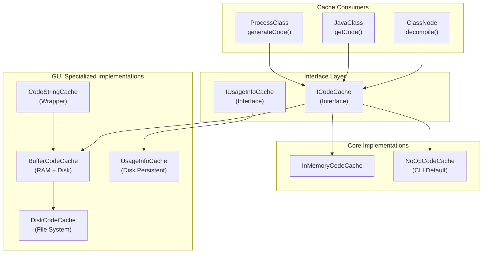
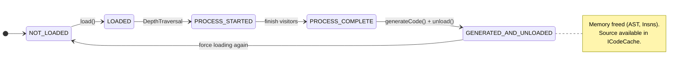
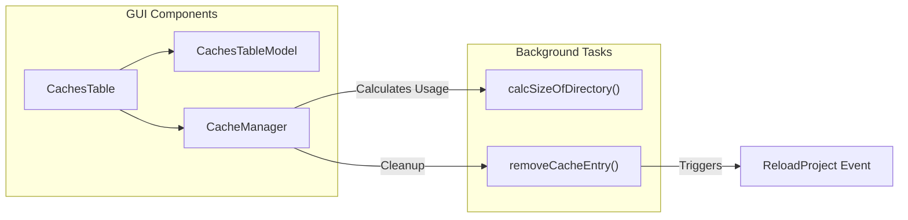

# Caching System

<details>
<summary>Relevant source files</summary>

The following files were used as context for generating this wiki page:

- [jadx-commons/jadx-app-commons/README.md](https://github.com/skylot/jadx/blob/HEAD/jadx-commons/jadx-app-commons/README.md)
- [jadx-commons/jadx-app-commons/src/main/java/jadx/commons/app/JadxCommonEnv.java](https://github.com/skylot/jadx/blob/HEAD/jadx-commons/jadx-app-commons/src/main/java/jadx/commons/app/JadxCommonEnv.java)
- [jadx-core/src/main/java/jadx/api/plugins/JadxPlugin.java](https://github.com/skylot/jadx/blob/HEAD/jadx-core/src/main/java/jadx/api/plugins/JadxPlugin.java)
- [jadx-core/src/main/java/jadx/api/plugins/events/types/ReloadProject.java](https://github.com/skylot/jadx/blob/HEAD/jadx-core/src/main/java/jadx/api/plugins/events/types/ReloadProject.java)
- [jadx-core/src/main/java/jadx/api/plugins/gui/ISettingsGroup.java](https://github.com/skylot/jadx/blob/HEAD/jadx-core/src/main/java/jadx/api/plugins/gui/ISettingsGroup.java)
- [jadx-core/src/main/java/jadx/core/deobf/NameMapper.java](https://github.com/skylot/jadx/blob/HEAD/jadx-core/src/main/java/jadx/core/deobf/NameMapper.java)
- [jadx-core/src/main/java/jadx/core/dex/info/ConstStorage.java](https://github.com/skylot/jadx/blob/HEAD/jadx-core/src/main/java/jadx/core/dex/info/ConstStorage.java)
- [jadx-core/src/main/java/jadx/core/utils/StringUtils.java](https://github.com/skylot/jadx/blob/HEAD/jadx-core/src/main/java/jadx/core/utils/StringUtils.java)
- [jadx-gui/src/main/java/jadx/gui/cache/code/CodeCacheMode.java](https://github.com/skylot/jadx/blob/HEAD/jadx-gui/src/main/java/jadx/gui/cache/code/CodeCacheMode.java)
- [jadx-gui/src/main/java/jadx/gui/cache/code/disk/DiskCodeCache.java](https://github.com/skylot/jadx/blob/HEAD/jadx-gui/src/main/java/jadx/gui/cache/code/disk/DiskCodeCache.java)
- [jadx-gui/src/main/java/jadx/gui/logs/LogPanel.java](https://github.com/skylot/jadx/blob/HEAD/jadx-gui/src/main/java/jadx/gui/logs/LogPanel.java)
- [jadx-gui/src/main/java/jadx/gui/settings/ui/SettingsGroup.java](https://github.com/skylot/jadx/blob/HEAD/jadx-gui/src/main/java/jadx/gui/settings/ui/SettingsGroup.java)
- [jadx-gui/src/main/java/jadx/gui/settings/ui/cache/CachesTable.java](https://github.com/skylot/jadx/blob/HEAD/jadx-gui/src/main/java/jadx/gui/settings/ui/cache/CachesTable.java)
- [jadx-gui/src/main/java/jadx/gui/settings/ui/plugins/PluginSettingsGroup.java](https://github.com/skylot/jadx/blob/HEAD/jadx-gui/src/main/java/jadx/gui/settings/ui/plugins/PluginSettingsGroup.java)
- [jadx-gui/src/main/java/jadx/gui/treemodel/ApkSignatureNode.java](https://github.com/skylot/jadx/blob/HEAD/jadx-gui/src/main/java/jadx/gui/treemodel/ApkSignatureNode.java)
- [jadx-gui/src/main/java/jadx/gui/ui/action/ActionCategory.java](https://github.com/skylot/jadx/blob/HEAD/jadx-gui/src/main/java/jadx/gui/ui/action/ActionCategory.java)
- [jadx-gui/src/main/java/jadx/gui/utils/NLS.java](https://github.com/skylot/jadx/blob/HEAD/jadx-gui/src/main/java/jadx/gui/utils/NLS.java)
- [jadx-gui/src/main/java/jadx/gui/utils/files/JadxFiles.java](https://github.com/skylot/jadx/blob/HEAD/jadx-gui/src/main/java/jadx/gui/utils/files/JadxFiles.java)
- [jadx-gui/src/main/java/jadx/gui/utils/plugins/CloseablePlugins.java](https://github.com/skylot/jadx/blob/HEAD/jadx-gui/src/main/java/jadx/gui/utils/plugins/CloseablePlugins.java)
- [jadx-gui/src/test/java/jadx/gui/TestI18n.java](https://github.com/skylot/jadx/blob/HEAD/jadx-gui/src/test/java/jadx/gui/TestI18n.java)
- [jadx-plugins-tools/src/main/java/jadx/plugins/tools/utils/PluginFiles.java](https://github.com/skylot/jadx/blob/HEAD/jadx-plugins-tools/src/main/java/jadx/plugins/tools/utils/PluginFiles.java)

</details>


The caching system in JADX provides a multi-tier storage architecture for decompiled code and usage data. It enables fast access to previously processed classes, reduces redundant decompilation work, and manages memory pressure by offloading generated source code and internal data structures.

---

## Cache Architecture Overview

JADX employs a hierarchical caching strategy with two primary components: the **Code Cache** for decompiled source code and the **Usage Cache** for cross-reference information. The system is designed to be pluggable via interfaces, allowing different implementations based on environment (CLI vs. GUI) and resource constraints.

### Code and Usage Cache Hierarchy

The following diagram bridges the high-level cache concepts to the specific implementation classes found in the codebase.



**Sources:** [jadx-core/src/main/java/jadx/core/dex/nodes/ClassNode.java:19-20](https://github.com/skylot/jadx/blob/HEAD/jadx-core/src/main/java/jadx/core/dex/nodes/ClassNode.java#L19-L20), [jadx-api/src/main/java/jadx/api/JavaClass.java:57-63](https://github.com/skylot/jadx/blob/HEAD/jadx-api/src/main/java/jadx/api/JavaClass.java#L57-L63), [jadx-core/src/main/java/jadx/core/dex/nodes/RootNode.java:20-20](https://github.com/skylot/jadx/blob/HEAD/jadx-core/src/main/java/jadx/core/dex/nodes/RootNode.java#L20), [jadx-core/src/main/java/jadx/core/ProcessClass.java:127-131](https://github.com/skylot/jadx/blob/HEAD/jadx-core/src/main/java/jadx/core/ProcessClass.java#L127-L131)

---

## Code Cache Implementations

The `ICodeCache` interface defines the contract for storing and retrieving `ICodeInfo` (the result of decompilation). In the GUI application, the mode is configurable via `CodeCacheMode`.

### 1. InMemoryCodeCache
Stores decompiled code in a memory-based structure (typically a `ConcurrentHashMap`) in the JVM heap.
- **Persistence**: Session-only.
- **Performance**: Fastest access.
- **Use Case**: Small to medium projects where RAM is abundant.
- **GUI Label**: `preferences.codeCacheMode.memory` [jadx-gui/src/main/java/jadx/gui/cache/code/CodeCacheMode.java:9](https://github.com/skylot/jadx/blob/HEAD/jadx-gui/src/main/java/jadx/gui/cache/code/CodeCacheMode.java#L9).

### 2. DiskCodeCache
Persists decompiled code to the file system.
- **Persistence**: Persistent across application restarts.
- **Mechanism**: Serializes code and metadata to files on disk [jadx-gui/src/main/java/jadx/gui/cache/code/disk/DiskCodeCache.java:1-10](https://github.com/skylot/jadx/blob/HEAD/jadx-gui/src/main/java/jadx/gui/cache/code/disk/DiskCodeCache.java#L1-L10).
- **GUI Label**: `preferences.codeCacheMode.disk` [jadx-gui/src/main/java/jadx/gui/cache/code/CodeCacheMode.java:11](https://github.com/skylot/jadx/blob/HEAD/jadx-gui/src/main/java/jadx/gui/cache/code/CodeCacheMode.java#L11).

### 3. BufferCodeCache
A hybrid implementation that acts as a memory buffer sitting in front of a `DiskCodeCache`.
- **Logic**: Provides immediate memory access for recently used classes while ensuring they are eventually persisted to disk via the wrapped `DiskCodeCache`.
- **GUI Label**: `preferences.codeCacheMode.diskWithCache` [jadx-gui/src/main/java/jadx/gui/cache/code/CodeCacheMode.java:10](https://github.com/skylot/jadx/blob/HEAD/jadx-gui/src/main/java/jadx/gui/cache/code/CodeCacheMode.java#L10).

### 4. NoOpCodeCache
A dummy implementation that does not store anything.
- **Use Case**: Default for CLI to minimize overhead when saving all files to disk anyway.

---

## Cache Modes and Configuration

The cache behavior is controlled by settings passed via `JadxArgs`. The `RootNode` maintains a `CacheStorage` instance to hold various cache-related data during the lifecycle of a `JadxDecompiler` instance.

| Mode | Implementation | Description |
| :--- | :--- | :--- |
| `MEMORY` | `InMemoryCodeCache` | All data kept in RAM. |
| `DISK_WITH_CACHE` | `BufferCodeCache` | Data buffered in RAM and saved to Disk. |
| `DISK` | `DiskCodeCache` | Data saved directly to Disk. |

### Initialization Logic
The `JadxDecompiler` orchestrates the loading process. During `load()`, the `RootNode` is initialized, and it sets up the internal `InfoStorage` and `CacheStorage`.

```java
// RootNode initialization in JadxDecompiler.load()
root = new RootNode(this);
root.init();
root.loadClasses(loadedInputs);
```

**Sources:** [jadx-api/src/main/java/jadx/api/JadxDecompiler.java:127-130](https://github.com/skylot/jadx/blob/HEAD/jadx-api/src/main/java/jadx/api/JadxDecompiler.java#L127-L130), [jadx-core/src/main/java/jadx/core/dex/nodes/RootNode.java:76-77](https://github.com/skylot/jadx/blob/HEAD/jadx-core/src/main/java/jadx/core/dex/nodes/RootNode.java#L76-L77), [jadx-core/src/main/java/jadx/core/dex/nodes/RootNode.java:107-129](https://github.com/skylot/jadx/blob/HEAD/jadx-core/src/main/java/jadx/core/dex/nodes/RootNode.java#L107-L129), [jadx-gui/src/main/java/jadx/gui/cache/code/CodeCacheMode.java:8-11](https://github.com/skylot/jadx/blob/HEAD/jadx-gui/src/main/java/jadx/gui/cache/code/CodeCacheMode.java#L8-L11)

---

## Memory Management: Node Unloading

To prevent `OutOfMemoryError` on large APKs, JADX supports unloading class data while retaining the ability to restore it from cache.

### Unload Strategy
When a class is unloaded via `ClassNode.unloadCode()`, its internal state is managed by `ProcessClass`. The system can transition between states to free memory.



- **LOADED**: Class bytecode is loaded into `ClassNode` [jadx-core/src/main/java/jadx/core/dex/nodes/ProcessState.java:56](https://github.com/skylot/jadx/blob/HEAD/jadx-core/src/main/java/jadx/core/dex/nodes/ProcessState.java#L56).
- **PROCESS_COMPLETE**: All decompilation visitors have finished [jadx-core/src/main/java/jadx/core/ProcessClass.java:85](https://github.com/skylot/jadx/blob/HEAD/jadx-core/src/main/java/jadx/core/ProcessClass.java#L85).
- **GENERATED_AND_UNLOADED**: Code has been generated and saved to cache; internal structures (instructions, regions) are cleared to save memory [jadx-core/src/main/java/jadx/core/ProcessClass.java:92](https://github.com/skylot/jadx/blob/HEAD/jadx-core/src/main/java/jadx/core/ProcessClass.java#L92).

**Sources:** [jadx-core/src/main/java/jadx/core/ProcessClass.java:29-34](https://github.com/skylot/jadx/blob/HEAD/jadx-core/src/main/java/jadx/core/ProcessClass.java#L29-L34), [jadx-core/src/main/java/jadx/core/ProcessClass.java:77-94](https://github.com/skylot/jadx/blob/HEAD/jadx-core/src/main/java/jadx/core/ProcessClass.java#L77-L94), [jadx-core/src/main/java/jadx/api/JavaClass.java:89-92](https://github.com/skylot/jadx/blob/HEAD/jadx-core/src/main/java/jadx/api/JavaClass.java#L89-L92)

---

## GUI Cache Management

The JADX GUI provides a dedicated interface for managing disk caches through the `CachesTable` and `CacheManager`.

### Cache Monitoring and Cleanup
Users can view cache usage and delete specific or all cache entries. The `CachesTable` calculates directory sizes on background threads to avoid UI freezes.



- **Size Calculation**: Uses `Files.walk(dir)` and `Files.getFileStore(dir).getBlockSize()` to accurately report disk usage [jadx-gui/src/main/java/jadx/gui/settings/ui/cache/CachesTable.java:115-129](https://github.com/skylot/jadx/blob/HEAD/jadx-gui/src/main/java/jadx/gui/settings/ui/cache/CachesTable.java#L115-L129).
- **Project Integration**: If the cache for the currently open project is deleted, JADX triggers a `ReloadProject.EVENT` to ensure the UI stays consistent with the filesystem [jadx-gui/src/main/java/jadx/gui/settings/ui/cache/CachesTable.java:157-159](https://github.com/skylot/jadx/blob/HEAD/jadx-gui/src/main/java/jadx/gui/settings/ui/cache/CachesTable.java#L157-L159).

**Sources:** [jadx-gui/src/main/java/jadx/gui/settings/ui/cache/CachesTable.java:29-39](https://github.com/skylot/jadx/blob/HEAD/jadx-gui/src/main/java/jadx/gui/settings/ui/cache/CachesTable.java#L29-L39), [jadx-gui/src/main/java/jadx/gui/settings/ui/cache/CachesTable.java:115-134](https://github.com/skylot/jadx/blob/HEAD/jadx-gui/src/main/java/jadx/gui/settings/ui/cache/CachesTable.java#L115-L134), [jadx-gui/src/main/java/jadx/gui/settings/ui/cache/CachesTable.java:163-176](https://github.com/skylot/jadx/blob/HEAD/jadx-gui/src/main/java/jadx/gui/settings/ui/cache/CachesTable.java#L163-L176)

---

## File and Directory Management

JADX uses temporary directories for intermediate processing, managed via `FileUtils` and platform-specific logic in `JadxCommonEnv`.

### Cache and Temp Locations
1. **System Temp**: Managed by `FileUtils.updateTempRootDir()`. The root temp directory is cleared upon decompiler closure.
2. **Persistent Cache**: GUI cache entries are typically stored in platform-appropriate directories (e.g., `~/.cache/jadx` on Linux) [jadx-commons/jadx-app-commons/src/main/java/jadx/commons/app/JadxCommonEnv.java:1-15](https://github.com/skylot/jadx/blob/HEAD/jadx-commons/jadx-app-commons/src/main/java/jadx/commons/app/JadxCommonEnv.java#L1-L15).

### Cleanup
The `JadxDecompiler.close()` method ensures that temporary resources are released and directories are deleted.

```java
@Override
public void close() {
    reset();
    closeAll(loadedInputs);
    // ...
    FileUtils.deleteDirIfExists(args.getFilesGetter().getTempDir());
    args.close();
    FileUtils.clearTempRootDir();
}
```

**Sources:** [jadx-api/src/main/java/jadx/api/JadxDecompiler.java:190-199](https://github.com/skylot/jadx/blob/HEAD/jadx-api/src/main/java/jadx/api/JadxDecompiler.java#L190-L199), [jadx-core/src/main/java/jadx/core/dex/nodes/ClassNode.java:72](https://github.com/skylot/jadx/blob/HEAD/jadx-core/src/main/java/jadx/core/dex/nodes/ClassNode.java#L72), [jadx-core/src/main/java/jadx/core/dex/nodes/ClassNode.java:124](https://github.com/skylot/jadx/blob/HEAD/jadx-core/src/main/java/jadx/core/dex/nodes/ClassNode.java#L124)

---

## Usage Info Cache

The Usage Cache tracks cross-references (XREFs). It allows the engine to quickly find where a class, method, or field is referenced without re-scanning the entire codebase.

- **Restoration**: When a class is reloaded, JADX attempts to restore usage data from the cache via `ClassNode.restoreUsageData()`.
- **Integration**: The `RootNode` provides access to the `UsageInfoCache` via `JadxArgs`.

```java
private void restoreUsageData() {
    IUsageInfoData usageInfoData = root.getArgs().getUsageInfoCache().get(root);
    if (usageInfoData != null) {
        usageInfoData.applyForClass(this);
    }
}
```

**Sources:** [jadx-core/src/main/java/jadx/core/dex/nodes/ClassNode.java:148-155](https://github.com/skylot/jadx/blob/HEAD/jadx-core/src/main/java/jadx/core/dex/nodes/ClassNode.java#L148-L155), [jadx-api/src/main/java/jadx/api/JavaClass.java:243-245](https://github.com/skylot/jadx/blob/HEAD/jadx-api/src/main/java/jadx/api/JavaClass.java#L243-L245)