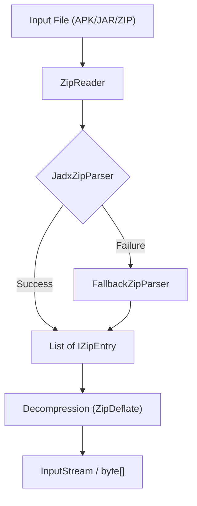
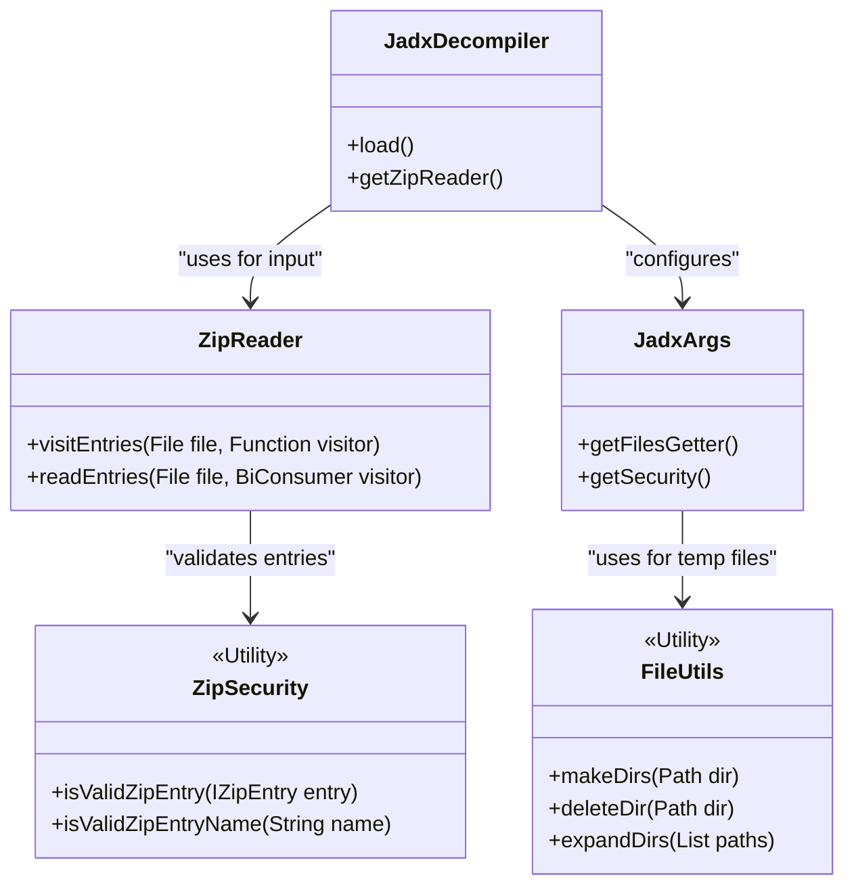

# ZIP and File Utilities

Relevant source files

The following files were used as context for generating this wiki page:

- [README.md](https://github.com/skylot/jadx/blob/HEAD/README.md)
- [jadx-cli/src/main/java/jadx/cli/JCommanderWrapper.java](https://github.com/skylot/jadx/blob/HEAD/jadx-cli/src/main/java/jadx/cli/JCommanderWrapper.java)
- [jadx-cli/src/main/java/jadx/cli/JadxCLI.java](https://github.com/skylot/jadx/blob/HEAD/jadx-cli/src/main/java/jadx/cli/JadxCLI.java)
- [jadx-cli/src/main/java/jadx/cli/JadxCLIArgs.java](https://github.com/skylot/jadx/blob/HEAD/jadx-cli/src/main/java/jadx/cli/JadxCLIArgs.java)
- [jadx-cli/src/main/java/jadx/cli/LogHelper.java](https://github.com/skylot/jadx/blob/HEAD/jadx-cli/src/main/java/jadx/cli/LogHelper.java)
- [jadx-cli/src/test/java/jadx/cli/JadxCLIArgsTest.java](https://github.com/skylot/jadx/blob/HEAD/jadx-cli/src/test/java/jadx/cli/JadxCLIArgsTest.java)
- [jadx-commons/jadx-zip/src/main/java/jadx/zip/ZipReader.java](https://github.com/skylot/jadx/blob/HEAD/jadx-commons/jadx-zip/src/main/java/jadx/zip/ZipReader.java)
- [jadx-commons/jadx-zip/src/main/java/jadx/zip/fallback/FallbackException.java](https://github.com/skylot/jadx/blob/HEAD/jadx-commons/jadx-zip/src/main/java/jadx/zip/fallback/FallbackException.java)
- [jadx-commons/jadx-zip/src/main/java/jadx/zip/fallback/FallbackZipParser.java](https://github.com/skylot/jadx/blob/HEAD/jadx-commons/jadx-zip/src/main/java/jadx/zip/fallback/FallbackZipParser.java)
- [jadx-commons/jadx-zip/src/main/java/jadx/zip/io/ByteBufferBackedInputStream.java](https://github.com/skylot/jadx/blob/HEAD/jadx-commons/jadx-zip/src/main/java/jadx/zip/io/ByteBufferBackedInputStream.java)
- [jadx-commons/jadx-zip/src/main/java/jadx/zip/io/LimitedInputStream.java](https://github.com/skylot/jadx/blob/HEAD/jadx-commons/jadx-zip/src/main/java/jadx/zip/io/LimitedInputStream.java)
- [jadx-commons/jadx-zip/src/main/java/jadx/zip/parser/JadxZipEntry.java](https://github.com/skylot/jadx/blob/HEAD/jadx-commons/jadx-zip/src/main/java/jadx/zip/parser/JadxZipEntry.java)
- [jadx-commons/jadx-zip/src/main/java/jadx/zip/parser/JadxZipParser.java](https://github.com/skylot/jadx/blob/HEAD/jadx-commons/jadx-zip/src/main/java/jadx/zip/parser/JadxZipParser.java)
- [jadx-commons/jadx-zip/src/main/java/jadx/zip/parser/ZipDeflate.java](https://github.com/skylot/jadx/blob/HEAD/jadx-commons/jadx-zip/src/main/java/jadx/zip/parser/ZipDeflate.java)
- [jadx-commons/jadx-zip/src/main/java/jadx/zip/security/JadxZipSecurity.java](https://github.com/skylot/jadx/blob/HEAD/jadx-commons/jadx-zip/src/main/java/jadx/zip/security/JadxZipSecurity.java)
- [jadx-core/src/main/java/jadx/api/JadxArgs.java](https://github.com/skylot/jadx/blob/HEAD/jadx-core/src/main/java/jadx/api/JadxArgs.java)
- [jadx-core/src/main/java/jadx/api/plugins/utils/ZipSecurity.java](https://github.com/skylot/jadx/blob/HEAD/jadx-core/src/main/java/jadx/api/plugins/utils/ZipSecurity.java)
- [jadx-core/src/main/java/jadx/core/utils/ImmutableList.java](https://github.com/skylot/jadx/blob/HEAD/jadx-core/src/main/java/jadx/core/utils/ImmutableList.java)
- [jadx-core/src/main/java/jadx/core/utils/Utils.java](https://github.com/skylot/jadx/blob/HEAD/jadx-core/src/main/java/jadx/core/utils/Utils.java)
- [jadx-core/src/main/java/jadx/core/utils/files/FileUtils.java](https://github.com/skylot/jadx/blob/HEAD/jadx-core/src/main/java/jadx/core/utils/files/FileUtils.java)
- [jadx-core/src/main/java/jadx/core/xmlgen/BinaryXMLParser.java](https://github.com/skylot/jadx/blob/HEAD/jadx-core/src/main/java/jadx/core/xmlgen/BinaryXMLParser.java)
- [jadx-core/src/test/java/jadx/core/utils/ImmutableListTest.java](https://github.com/skylot/jadx/blob/HEAD/jadx-core/src/test/java/jadx/core/utils/ImmutableListTest.java)
- [jadx-gui/src/main/java/jadx/gui/JadxGUI.java](https://github.com/skylot/jadx/blob/HEAD/jadx-gui/src/main/java/jadx/gui/JadxGUI.java)
- [jadx-gui/src/main/java/jadx/gui/JadxWrapper.java](https://github.com/skylot/jadx/blob/HEAD/jadx-gui/src/main/java/jadx/gui/JadxWrapper.java)

JADX provides a robust infrastructure for handling filesystem operations and archive parsing. Central to this is a custom ZIP implementation (`jadx-zip`) designed to handle malformed or obfuscated APK/ZIP files that standard Java libraries might fail to parse. This is complemented by security layers to prevent path traversal attacks and the `FileUtils` class for common filesystem tasks.

## 1. Custom ZIP Parsing (jadx-zip)

The `jadx-zip` module is a standalone implementation for reading ZIP archives. It provides multiple parsing strategies to ensure compatibility with various Android packaging quirks.

### 1.1 Key Components and Data Flow

The system uses a tiered approach to archive access, orchestrated by `ZipReader` [jadx-api/plugins/utils/ZipSecurity.java:18-18](https://github.com/skylot/jadx/blob/HEAD/jadx-api/plugins/utils/ZipSecurity.java#L18).

| Class | Role |
| --- | --- |
| `ZipReader` | The primary entry point for reading ZIP files. It manages the lifecycle of the underlying parser [jadx-commons/jadx-zip/src/main/java/jadx/zip/ZipReader.java:19-21](https://github.com/skylot/jadx/blob/HEAD/jadx-commons/jadx-zip/src/main/java/jadx/zip/ZipReader.java#L19-L21). |
| `JadxZipParser` | The default parser. It performs manual parsing of the ZIP Central Directory to handle non-standard archives [jadx-commons/jadx-zip/src/main/java/jadx/zip/parser/JadxZipParser.java:37-37](https://github.com/skylot/jadx/blob/HEAD/jadx-commons/jadx-zip/src/main/java/jadx/zip/parser/JadxZipParser.java#L37). |
| `FallbackZipParser` | A wrapper around `java.util.zip.ZipFile` used if the custom parser fails [jadx-commons/jadx-zip/src/main/java/jadx/zip/fallback/FallbackZipParser.java:23-23](https://github.com/skylot/jadx/blob/HEAD/jadx-commons/jadx-zip/src/main/java/jadx/zip/fallback/FallbackZipParser.java#L23). |
| `IZipEntry` | Interface representing a single entry (file) within the ZIP archive [jadx-api/plugins/utils/ZipSecurity.java:17-17](https://github.com/skylot/jadx/blob/HEAD/jadx-api/plugins/utils/ZipSecurity.java#L17). |
| `ZipDeflate` | Handles decompression logic using `java.util.zip.Inflater` [jadx-commons/jadx-zip/src/main/java/jadx/zip/parser/ZipDeflate.java:11-11](https://github.com/skylot/jadx/blob/HEAD/jadx-commons/jadx-zip/src/main/java/jadx/zip/parser/ZipDeflate.java#L11). |

**Archive Loading Workflow:**

Sources: [jadx-api/plugins/utils/ZipSecurity.java:37-37](https://github.com/skylot/jadx/blob/HEAD/jadx-api/plugins/utils/ZipSecurity.java#L37), [jadx-commons/jadx-zip/src/main/java/jadx/zip/parser/ZipDeflate.java:14-37](https://github.com/skylot/jadx/blob/HEAD/jadx-commons/jadx-zip/src/main/java/jadx/zip/parser/ZipDeflate.java#L14-L37), [jadx-commons/jadx-zip/src/main/java/jadx/zip/ZipReader.java:25-45](https://github.com/skylot/jadx/blob/HEAD/jadx-commons/jadx-zip/src/main/java/jadx/zip/ZipReader.java#L25-L45)

### 1.2 Specialized Stream Handling
To optimize memory and performance, JADX uses specialized input streams:
*   `LimitedInputStream`: Ensures that a stream cannot read beyond the declared entry size, preventing certain classes of resource exhaustion [jadx-api/plugins/utils/ZipSecurity.java:76-76](https://github.com/skylot/jadx/blob/HEAD/jadx-api/plugins/utils/ZipSecurity.java#L76).
*   `ByteBufferBackedInputStream`: Allows streaming data directly from a memory-mapped `ByteBuffer` [jadx-commons/jadx-zip/src/main/java/jadx/zip/io/ByteBufferBackedInputStream.java:7-13](https://github.com/skylot/jadx/blob/HEAD/jadx-commons/jadx-zip/src/main/java/jadx/zip/io/ByteBufferBackedInputStream.java#L7-L13).

## 2. ZipSecurity

The `ZipSecurity` class and the `IJadxZipSecurity` interface protect JADX from malicious archives designed to exploit the host system. Security checks can be disabled via the `JADX_DISABLE_ZIP_SECURITY` environment variable [jadx-api/plugins/utils/ZipSecurity.java:31-31](https://github.com/skylot/jadx/blob/HEAD/jadx-api/plugins/utils/ZipSecurity.java#L31).

### 2.1 Path Traversal Protection
JADX validates every entry name to ensure it does not attempt to write outside the intended output directory (e.g., using `../` sequences).

*   **Validation**: `isValidZipEntryName(String entryName)` checks for ".." and ensures the resolved path is safe [jadx-api/plugins/utils/ZipSecurity.java:59-61](https://github.com/skylot/jadx/blob/HEAD/jadx-api/plugins/utils/ZipSecurity.java#L59-L61).
*   **Sub-directory Check**: `isInSubDirectory(File baseDir, File file)` verifies that a file is physically located within a specific base directory [jadx-api/plugins/utils/ZipSecurity.java:51-53](https://github.com/skylot/jadx/blob/HEAD/jadx-api/plugins/utils/ZipSecurity.java#L51-L53).

### 2.2 ZIP Bomb Detection
The `isZipBomb` check prevents decompression of entries with suspicious compression ratios or excessive entry counts.
*   **Thresholds**: By default, it flags archives exceeding `JADX_ZIP_MAX_ENTRIES_COUNT` (default 100,000) [jadx-api/plugins/utils/ZipSecurity.java:33-33](https://github.com/skylot/jadx/blob/HEAD/jadx-api/plugins/utils/ZipSecurity.java#L33).
*   **Logic**: `isValidZipEntry(IZipEntry entry)` delegates to `IJadxZipSecurity` to check uncompressed size and ratios [jadx-api/plugins/utils/ZipSecurity.java:67-69](https://github.com/skylot/jadx/blob/HEAD/jadx-api/plugins/utils/ZipSecurity.java#L67-L69).

Sources: [jadx-api/plugins/utils/ZipSecurity.java:30-69](https://github.com/skylot/jadx/blob/HEAD/jadx-api/plugins/utils/ZipSecurity.java#L30-L69), [jadx-commons/jadx-zip/src/main/java/jadx/zip/security/JadxZipSecurity.java:13-98](https://github.com/skylot/jadx/blob/HEAD/jadx-commons/jadx-zip/src/main/java/jadx/zip/security/JadxZipSecurity.java#L13-L98)

## 3. FileUtils

The `FileUtils` class provides a centralized set of filesystem operations used throughout the core and CLI modules [jadx-core/src/main/java/jadx/core/utils/files/FileUtils.java:45-45](https://github.com/skylot/jadx/blob/HEAD/jadx-core/src/main/java/jadx/core/utils/files/FileUtils.java#L45).

### 3.1 Directory and File Management
`FileUtils` handles recursive directory operations and temporary file management.

| Function | Description |
| --- | --- |
| `makeDirs(Path dir)` | Synchronized directory creation to prevent race conditions [jadx-core/src/main/java/jadx/core/utils/files/FileUtils.java:144-153](https://github.com/skylot/jadx/blob/HEAD/jadx-core/src/main/java/jadx/core/utils/files/FileUtils.java#L144-L153). |
| `deleteDir(Path dir)` | Recursively deletes a directory and all its contents [jadx-core/src/main/java/jadx/core/utils/files/FileUtils.java:169-171](https://github.com/skylot/jadx/blob/HEAD/jadx-core/src/main/java/jadx/core/utils/files/FileUtils.java#L169-L171). |
| `expandDirs(List<Path> paths)` | Walks through provided paths and expands directories into a flat list of files [jadx-core/src/main/java/jadx/core/utils/files/FileUtils.java:99-109](https://github.com/skylot/jadx/blob/HEAD/jadx-core/src/main/java/jadx/core/utils/files/FileUtils.java#L99-L109). |
| `createTempRootDir()` | Initializes the root directory for JADX temporary files using the `jadx-instance-` prefix [jadx-core/src/main/java/jadx/core/utils/files/FileUtils.java:73-81](https://github.com/skylot/jadx/blob/HEAD/jadx-core/src/main/java/jadx/core/utils/files/FileUtils.java#L73-L81). |

### 3.2 File Name Sanitization
To support cross-platform compatibility, JADX sanitizes file names to fit within OS constraints (e.g., `MAX_FILENAME_LENGTH = 128`) [jadx-core/src/main/java/jadx/core/utils/files/FileUtils.java:49-49](https://github.com/skylot/jadx/blob/HEAD/jadx-core/src/main/java/jadx/core/utils/files/FileUtils.java#L49).

Sources: [jadx-core/src/main/java/jadx/core/utils/files/FileUtils.java:45-181](https://github.com/skylot/jadx/blob/HEAD/jadx-core/src/main/java/jadx/core/utils/files/FileUtils.java#L45-L181)

## 4. Architectural Integration

The following diagram illustrates how the ZIP and File utilities bridge the gap between high-level orchestration and the raw filesystem.

### 4.1 CLI and GUI Usage
*   **CLI**: `JadxCLIArgs` uses `FileUtils` to validate output directories and handle mapping paths [jadx-cli/src/main/java/jadx/cli/JadxCLIArgs.java:45-45](https://github.com/skylot/jadx/blob/HEAD/jadx-cli/src/main/java/jadx/cli/JadxCLIArgs.java#L45).
*   **GUI**: `JadxWrapper` utilizes `FileUtils` for managing project-specific cache directories and temporary instances [jadx-gui/src/main/java/jadx/gui/JadxWrapper.java:35-35](https://github.com/skylot/jadx/blob/HEAD/jadx-gui/src/main/java/jadx/gui/JadxWrapper.java#L35).

Sources: [jadx-api/src/main/java/jadx/api/JadxArgs.java:45-45](https://github.com/skylot/jadx/blob/HEAD/jadx-api/src/main/java/jadx/api/JadxArgs.java#L45), [jadx-cli/src/main/java/jadx/cli/JadxCLIArgs.java:45-45](https://github.com/skylot/jadx/blob/HEAD/jadx-cli/src/main/java/jadx/cli/JadxCLIArgs.java#L45), [jadx-gui/src/main/java/jadx/gui/JadxWrapper.java:35-35](https://github.com/skylot/jadx/blob/HEAD/jadx-gui/src/main/java/jadx/gui/JadxWrapper.java#L35)