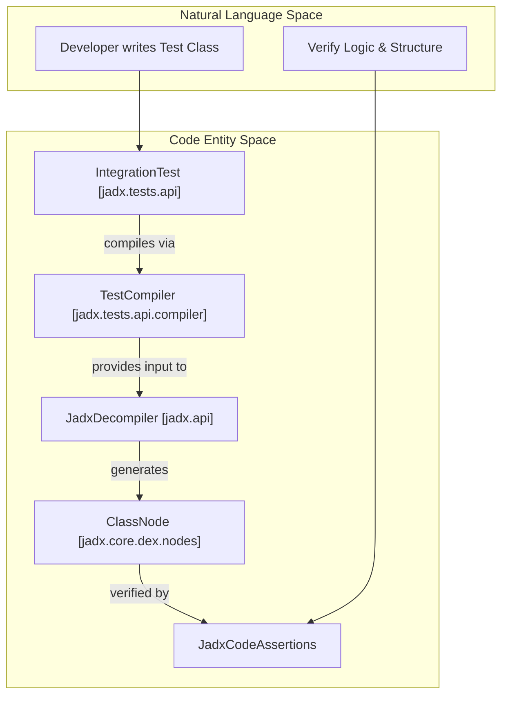
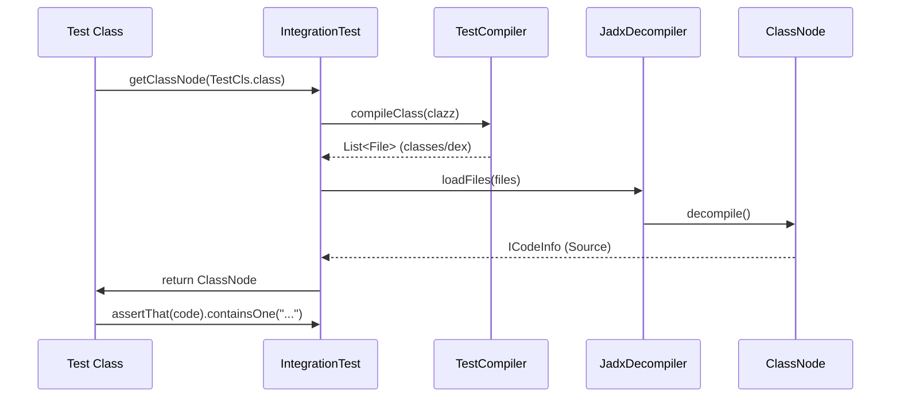

# Testing Framework

Relevant source files

The following files were used as context for generating this wiki page:

- [jadx-core/src/main/java/jadx/api/JadxDecompiler.java](https://github.com/skylot/jadx/blob/HEAD/jadx-core/src/main/java/jadx/api/JadxDecompiler.java)
- [jadx-core/src/main/java/jadx/api/JavaClass.java](https://github.com/skylot/jadx/blob/HEAD/jadx-core/src/main/java/jadx/api/JavaClass.java)
- [jadx-core/src/main/java/jadx/api/JavaField.java](https://github.com/skylot/jadx/blob/HEAD/jadx-core/src/main/java/jadx/api/JavaField.java)
- [jadx-core/src/main/java/jadx/api/JavaMethod.java](https://github.com/skylot/jadx/blob/HEAD/jadx-core/src/main/java/jadx/api/JavaMethod.java)
- [jadx-core/src/main/java/jadx/core/ProcessClass.java](https://github.com/skylot/jadx/blob/HEAD/jadx-core/src/main/java/jadx/core/ProcessClass.java)
- [jadx-core/src/main/java/jadx/core/dex/info/ClassInfo.java](https://github.com/skylot/jadx/blob/HEAD/jadx-core/src/main/java/jadx/core/dex/info/ClassInfo.java)
- [jadx-core/src/main/java/jadx/core/dex/nodes/ClassNode.java](https://github.com/skylot/jadx/blob/HEAD/jadx-core/src/main/java/jadx/core/dex/nodes/ClassNode.java)
- [jadx-core/src/main/java/jadx/core/dex/nodes/RootNode.java](https://github.com/skylot/jadx/blob/HEAD/jadx-core/src/main/java/jadx/core/dex/nodes/RootNode.java)
- [jadx-core/src/main/java/jadx/core/dex/visitors/MoveInlineVisitor.java](https://github.com/skylot/jadx/blob/HEAD/jadx-core/src/main/java/jadx/core/dex/visitors/MoveInlineVisitor.java)
- [jadx-core/src/main/java/jadx/core/utils/android/AndroidResourcesUtils.java](https://github.com/skylot/jadx/blob/HEAD/jadx-core/src/main/java/jadx/core/utils/android/AndroidResourcesUtils.java)
- [jadx-core/src/test/java/jadx/tests/api/IntegrationTest.java](https://github.com/skylot/jadx/blob/HEAD/jadx-core/src/test/java/jadx/tests/api/IntegrationTest.java)
- [jadx-core/src/test/java/jadx/tests/api/RaungTest.java](https://github.com/skylot/jadx/blob/HEAD/jadx-core/src/test/java/jadx/tests/api/RaungTest.java)
- [jadx-core/src/test/java/jadx/tests/api/SmaliTest.java](https://github.com/skylot/jadx/blob/HEAD/jadx-core/src/test/java/jadx/tests/api/SmaliTest.java)
- [jadx-core/src/test/java/jadx/tests/api/compiler/TestCompiler.java](https://github.com/skylot/jadx/blob/HEAD/jadx-core/src/test/java/jadx/tests/api/compiler/TestCompiler.java)
- [jadx-core/src/test/java/jadx/tests/api/extensions/profiles/TestProfile.java](https://github.com/skylot/jadx/blob/HEAD/jadx-core/src/test/java/jadx/tests/api/extensions/profiles/TestProfile.java)
- [jadx-core/src/test/java/jadx/tests/integration/conditions/TestConditions22.java](https://github.com/skylot/jadx/blob/HEAD/jadx-core/src/test/java/jadx/tests/integration/conditions/TestConditions22.java)

The JADX testing framework provides a robust infrastructure for validating decompiler correctness. It enables end-to-end verification by compiling Java source code into DEX/Jar, decompiling it back to Java, and performing both static assertions on the resulting code and functional verification via reflection.

## Overview

The framework is built around the `IntegrationTest` base class, which orchestrates the lifecycle of a test: from environment setup to final assertions.

Sources: [jadx-core/src/test/java/jadx/tests/api/IntegrationTest.java:85-132](https://github.com/skylot/jadx/blob/HEAD/jadx-core/src/test/java/jadx/tests/api/IntegrationTest.java#L85-L132), [jadx-core/src/test/java/jadx/tests/api/compiler/TestCompiler.java:37-54](https://github.com/skylot/jadx/blob/HEAD/jadx-core/src/test/java/jadx/tests/api/compiler/TestCompiler.java#L37-L54)

## Infrastructure Components

The testing system is split into two primary areas: the integration infrastructure and utility/assertion extensions.

### Integration Test Infrastructure
The core of the framework is `IntegrationTest`. It manages a temporary directory for build artifacts and configures `JadxArgs` with strict settings for testing, such as enabling debug comments and SSA consistency checks.

- **`IntegrationTest`**: The primary base class for Java-based tests. It handles the "Compile -> Decompile -> Assert" pipeline by coordinating with the internal `JadxDecompiler` [jadx-core/src/test/java/jadx/tests/api/IntegrationTest.java:132-160](https://github.com/skylot/jadx/blob/HEAD/jadx-core/src/test/java/jadx/tests/api/IntegrationTest.java#L132-L160).
- **`SmaliTest`**: Specialized for tests where the input is Smali assembly. It loads files from `src/test/smali` and typically bypasses Java input plugins [jadx-core/src/test/java/jadx/tests/api/SmaliTest.java:19-36](https://github.com/skylot/jadx/blob/HEAD/jadx-core/src/test/java/jadx/tests/api/SmaliTest.java#L19-L36).
- **`RaungTest`**: Similar to `SmaliTest`, but uses the Raung format for testing low-level bytecode transformations [jadx-core/src/test/java/jadx/tests/api/RaungTest.java:17-28](https://github.com/skylot/jadx/blob/HEAD/jadx-core/src/test/java/jadx/tests/api/RaungTest.java#L17-L28).

For details, see [Integration Test Infrastructure](44_9.1-integration-test-infrastructure.md).

### Test Utilities and Assertions
JADX uses specialized utilities to ensure the decompiler's internal state remains valid throughout the transformation pipeline.

- **`JadxCodeAssertions`**: Provides fluent assertions to validate the presence or absence of specific code patterns in the output.
- **`TestProfile`**: An enum defining environment configurations such as `D8_J11` (D8 compiler with Java 11) or `JAVA` (direct Java input) to ensure decompiler resilience across different toolchains [jadx-core/src/test/java/jadx/tests/api/extensions/profiles/TestProfile.java:8-25](https://github.com/skylot/jadx/blob/HEAD/jadx-core/src/test/java/jadx/tests/api/extensions/profiles/TestProfile.java#L8-L25).
- **`DebugChecks`**: A utility used within the core engine to validate SSA consistency and instruction integrity during visitor passes [jadx-core/src/main/java/jadx/core/dex/nodes/RootNode.java:56-56](https://github.com/skylot/jadx/blob/HEAD/jadx-core/src/main/java/jadx/core/dex/nodes/RootNode.java#L56).

For details, see [Test Utilities and Assertions](45_9.2-test-utilities-and-assertions.md).

## Testing Workflow

A typical JADX test involves defining a target class as an inner static class, which JADX then compiles, decompiles, and verifies.

Sources: [jadx-core/src/test/java/jadx/tests/api/IntegrationTest.java:187-211](https://github.com/skylot/jadx/blob/HEAD/jadx-core/src/test/java/jadx/tests/api/IntegrationTest.java#L187-L211), [jadx-core/src/test/java/jadx/tests/api/compiler/TestCompiler.java:37-54](https://github.com/skylot/jadx/blob/HEAD/jadx-core/src/test/java/jadx/tests/api/compiler/TestCompiler.java#L37-L54)

## Execution and Verification

### Static Verification
Tests use assertions on the `ClassNode` or the generated code string to verify the decompiler's structural output. This ensures that high-level constructs like `switch` statements or `try-catch` blocks are correctly reconstructed [jadx-core/src/test/java/jadx/tests/integration/conditions/TestConditions22.java:58-65](https://github.com/skylot/jadx/blob/HEAD/jadx-core/src/test/java/jadx/tests/integration/conditions/TestConditions22.java#L58-L65).

### Functional Verification (Auto-Check)
If the test class contains a method named `check()`, the framework can perform a functional "round-trip" verification:
1. The framework identifies the `check` method name constant [jadx-core/src/test/java/jadx/tests/api/IntegrationTest.java:105-105](https://github.com/skylot/jadx/blob/HEAD/jadx-core/src/test/java/jadx/tests/api/IntegrationTest.java#L105).
2. It executes the logic on the original compiled bytecode.
3. It compiles the **decompiled** source code generated by JADX.
4. It executes the `check()` method on the re-compiled class to ensure the decompiler did not break the program logic.

### Test Profiles
Using profiles, developers can run the same test logic against multiple compiler backends (DX, D8) and Java versions. This is controlled by the `USE_JAVA_INPUT` environment variable or profile extensions, ensuring JADX handles various bytecode patterns produced by different toolchains [jadx-core/src/test/java/jadx/tests/api/IntegrationTest.java:91-95](https://github.com/skylot/jadx/blob/HEAD/jadx-core/src/test/java/jadx/tests/api/IntegrationTest.java#L91-L95).

Sources: [jadx-core/src/test/java/jadx/tests/api/IntegrationTest.java:137-160](https://github.com/skylot/jadx/blob/HEAD/jadx-core/src/test/java/jadx/tests/api/IntegrationTest.java#L137-L160), [jadx-core/src/test/java/jadx/tests/api/extensions/profiles/TestProfile.java:1-25](https://github.com/skylot/jadx/blob/HEAD/jadx-core/src/test/java/jadx/tests/api/extensions/profiles/TestProfile.java#L1-L25)