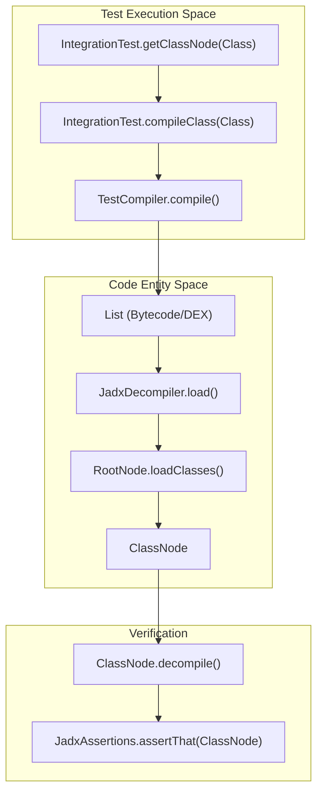
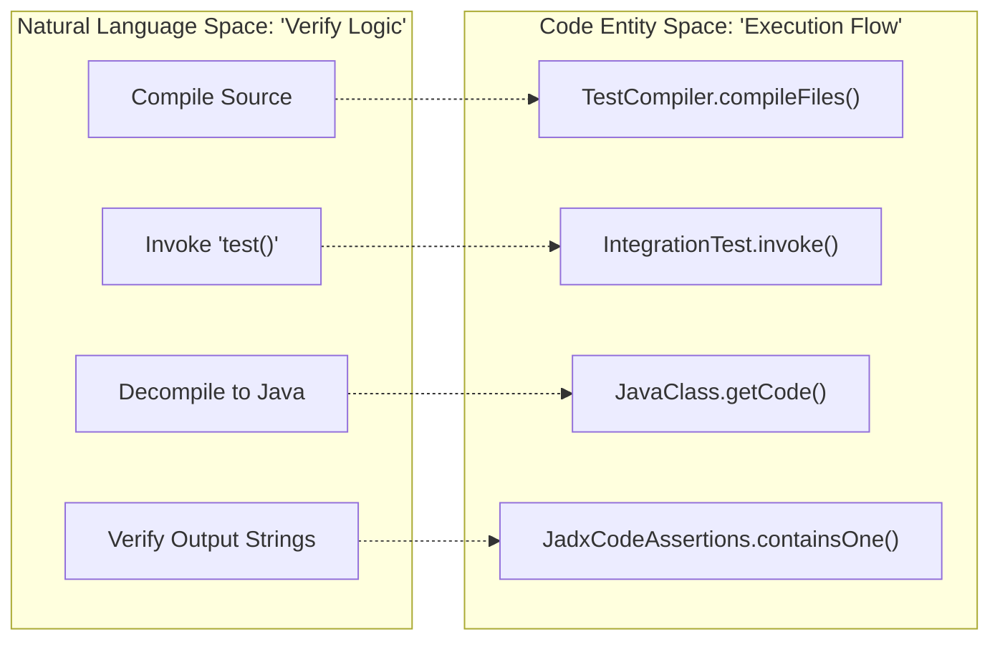

# Integration Test Infrastructure

Relevant source files

The following files were used as context for generating this wiki page:

- [jadx-core/src/main/java/jadx/api/JadxDecompiler.java](https://github.com/skylot/jadx/blob/HEAD/jadx-core/src/main/java/jadx/api/JadxDecompiler.java)
- [jadx-core/src/main/java/jadx/api/JavaClass.java](https://github.com/skylot/jadx/blob/HEAD/jadx-core/src/main/java/jadx/api/JavaClass.java)
- [jadx-core/src/main/java/jadx/api/JavaField.java](https://github.com/skylot/jadx/blob/HEAD/jadx-core/src/main/java/jadx/api/JavaField.java)
- [jadx-core/src/main/java/jadx/api/JavaMethod.java](https://github.com/skylot/jadx/blob/HEAD/jadx-core/src/main/java/jadx/api/JavaMethod.java)
- [jadx-core/src/main/java/jadx/core/ProcessClass.java](https://github.com/skylot/jadx/blob/HEAD/jadx-core/src/main/java/jadx/core/ProcessClass.java)
- [jadx-core/src/main/java/jadx/core/dex/info/ClassInfo.java](https://github.com/skylot/jadx/blob/HEAD/jadx-core/src/main/java/jadx/core/dex/info/ClassInfo.java)
- [jadx-core/src/main/java/jadx/core/dex/nodes/ClassNode.java](https://github.com/skylot/jadx/blob/HEAD/jadx-core/src/main/java/jadx/core/dex/nodes/ClassNode.java)
- [jadx-core/src/main/java/jadx/core/dex/nodes/RootNode.java](https://github.com/skylot/jadx/blob/HEAD/jadx-core/src/main/java/jadx/core/dex/nodes/RootNode.java)
- [jadx-core/src/main/java/jadx/core/dex/nodes/utils/SelectFromDuplicates.java](https://github.com/skylot/jadx/blob/HEAD/jadx-core/src/main/java/jadx/core/dex/nodes/utils/SelectFromDuplicates.java)
- [jadx-core/src/main/java/jadx/core/dex/visitors/MoveInlineVisitor.java](https://github.com/skylot/jadx/blob/HEAD/jadx-core/src/main/java/jadx/core/dex/visitors/MoveInlineVisitor.java)
- [jadx-core/src/main/java/jadx/core/utils/android/AndroidResourcesUtils.java](https://github.com/skylot/jadx/blob/HEAD/jadx-core/src/main/java/jadx/core/utils/android/AndroidResourcesUtils.java)
- [jadx-core/src/test/java/jadx/core/dex/nodes/utils/SelectFromDuplicatesTest.java](https://github.com/skylot/jadx/blob/HEAD/jadx-core/src/test/java/jadx/core/dex/nodes/utils/SelectFromDuplicatesTest.java)
- [jadx-core/src/test/java/jadx/tests/api/IntegrationTest.java](https://github.com/skylot/jadx/blob/HEAD/jadx-core/src/test/java/jadx/tests/api/IntegrationTest.java)
- [jadx-core/src/test/java/jadx/tests/api/RaungTest.java](https://github.com/skylot/jadx/blob/HEAD/jadx-core/src/test/java/jadx/tests/api/RaungTest.java)
- [jadx-core/src/test/java/jadx/tests/api/SmaliTest.java](https://github.com/skylot/jadx/blob/HEAD/jadx-core/src/test/java/jadx/tests/api/SmaliTest.java)
- [jadx-core/src/test/java/jadx/tests/api/compiler/TestCompiler.java](https://github.com/skylot/jadx/blob/HEAD/jadx-core/src/test/java/jadx/tests/api/compiler/TestCompiler.java)
- [jadx-core/src/test/java/jadx/tests/api/extensions/profiles/TestProfile.java](https://github.com/skylot/jadx/blob/HEAD/jadx-core/src/test/java/jadx/tests/api/extensions/profiles/TestProfile.java)
- [jadx-core/src/test/java/jadx/tests/api/utils/TestUtils.java](https://github.com/skylot/jadx/blob/HEAD/jadx-core/src/test/java/jadx/tests/api/utils/TestUtils.java)
- [jadx-core/src/test/java/jadx/tests/external/BaseExternalTest.java](https://github.com/skylot/jadx/blob/HEAD/jadx-core/src/test/java/jadx/tests/external/BaseExternalTest.java)
- [jadx-core/src/test/java/jadx/tests/integration/conditions/TestConditions22.java](https://github.com/skylot/jadx/blob/HEAD/jadx-core/src/test/java/jadx/tests/integration/conditions/TestConditions22.java)

The JADX integration test infrastructure provides a robust framework for verifying the correctness of the decompilation pipeline. It allows developers to write tests using Java source code, Smali, or Raung, which are then compiled to DEX/Bytecode, decompiled by JADX, and validated against expected output or runtime behavior.

## IntegrationTest Base Class

The `IntegrationTest` class [jadx-core/src/test/java/jadx/tests/api/IntegrationTest.java:85-85](https://github.com/skylot/jadx/blob/HEAD/jadx-core/src/test/java/jadx/tests/api/IntegrationTest.java#L85) is the foundation of the JADX testing suite. It manages the lifecycle of a test, including compilation, decompilation, and result assertion.

### Core Lifecycle and Data Flow

The infrastructure follows a specific pipeline to ensure that the decompiled code is accurate:
1.  **Source Preparation**: Java source code is extracted from the test's own source file or provided as a string.
2.  **Compilation**: The source is compiled into `.class` files using `TestCompiler` [jadx-core/src/test/java/jadx/tests/api/compiler/TestCompiler.java:32-36](https://github.com/skylot/jadx/blob/HEAD/jadx-core/src/test/java/jadx/tests/api/compiler/TestCompiler.java#L32-L36) and then optionally converted to `.dex` (via DX or D8) if `useDexInput()` is called [jadx-core/src/test/java/jadx/tests/api/IntegrationTest.java:304-307](https://github.com/skylot/jadx/blob/HEAD/jadx-core/src/test/java/jadx/tests/api/IntegrationTest.java#L304-L307).
3.  **Loading**: `JadxDecompiler` loads the resulting files [jadx-core/src/main/java/jadx/api/JadxDecompiler.java:119-139](https://github.com/skylot/jadx/blob/HEAD/jadx-core/src/main/java/jadx/api/JadxDecompiler.java#L119-L139).
4.  **Decompilation**: The core engine processes the `ClassNode` through various visitor passes orchestrated by `ProcessClass` [jadx-core/src/main/java/jadx/core/ProcessClass.java:77-86](https://github.com/skylot/jadx/blob/HEAD/jadx-core/src/main/java/jadx/core/ProcessClass.java#L77-L86).
5.  **Verification**: The output is checked for string matches or re-compiled and executed to verify logic.

### Data Flow Diagram: Java Source to Decompiled Output

This diagram bridges the "Natural Language" test requirements to the "Code Entity" space, showing how the infrastructure coordinates the transformation.

Sources: [jadx-core/src/test/java/jadx/tests/api/IntegrationTest.java:187-197](https://github.com/skylot/jadx/blob/HEAD/jadx-core/src/test/java/jadx/tests/api/IntegrationTest.java#L187-L197), [jadx-core/src/test/java/jadx/tests/api/IntegrationTest.java:213-225](https://github.com/skylot/jadx/blob/HEAD/jadx-core/src/test/java/jadx/tests/api/IntegrationTest.java#L213-L225), [jadx-core/src/main/java/jadx/api/JadxDecompiler.java:119-139](https://github.com/skylot/jadx/blob/HEAD/jadx-core/src/main/java/jadx/api/JadxDecompiler.java#L119-L139), [jadx-core/src/main/java/jadx/core/dex/nodes/RootNode.java:140-151](https://github.com/skylot/jadx/blob/HEAD/jadx-core/src/main/java/jadx/core/dex/nodes/RootNode.java#L140-L151)

### Key Methods and Configuration

| Method | Description |
| --- | --- |
| `getClassNode(Class<?> clazz)` | Compiles the provided class and returns its `ClassNode` representation [jadx-core/src/test/java/jadx/tests/api/IntegrationTest.java:187-197](https://github.com/skylot/jadx/blob/HEAD/jadx-core/src/test/java/jadx/tests/api/IntegrationTest.java#L187-L197). |
| `useDexInput()` | Configures the test to use DEX input (DX/D8) instead of direct Java input [jadx-core/src/test/java/jadx/tests/api/IntegrationTest.java:304-307](https://github.com/skylot/jadx/blob/HEAD/jadx-core/src/test/java/jadx/tests/api/IntegrationTest.java#L304-L307). |
| `decompileAndCheck(List<ClassNode> clsList)` | Orchestrates the decompilation and performs initial consistency checks [jadx-core/src/test/java/jadx/tests/api/IntegrationTest.java:330-334](https://github.com/skylot/jadx/blob/HEAD/jadx-core/src/test/java/jadx/tests/api/IntegrationTest.java#L330-L334). |
| `noDebugInfo()` | Configures `CompilerOptions` to omit debug information during compilation [jadx-core/src/test/java/jadx/tests/api/IntegrationTest.java:314-317](https://github.com/skylot/jadx/blob/HEAD/jadx-core/src/test/java/jadx/tests/api/IntegrationTest.java#L314-L317). |

Sources: [jadx-core/src/test/java/jadx/tests/api/IntegrationTest.java:187-334](https://github.com/skylot/jadx/blob/HEAD/jadx-core/src/test/java/jadx/tests/api/IntegrationTest.java#L187-L334), [jadx-core/src/test/java/jadx/tests/api/SmaliTest.java:30-36](https://github.com/skylot/jadx/blob/HEAD/jadx-core/src/test/java/jadx/tests/api/SmaliTest.java#L30-L36)

## Specialized Test Formats

While most tests use Java source, JADX supports testing against low-level formats to verify edge cases or specific bytecode patterns.

### SmaliTest
The `SmaliTest` class [jadx-core/src/test/java/jadx/tests/api/SmaliTest.java:19-19](https://github.com/skylot/jadx/blob/HEAD/jadx-core/src/test/java/jadx/tests/api/SmaliTest.java#L19) extends `IntegrationTest` to support testing against Smali files. This is essential for testing obfuscated code or patterns that are difficult to produce via a standard Java compiler.

*   **File Resolution**: It searches for `.smali` files in `src/test/smali` [jadx-core/src/test/java/jadx/tests/api/SmaliTest.java:21-22](https://github.com/skylot/jadx/blob/HEAD/jadx-core/src/test/java/jadx/tests/api/SmaliTest.java#L21-L22).
*   **Input Enforcement**: Smali tests automatically enforce `useDexInput()` because Smali is a representation of DEX bytecode [jadx-core/src/test/java/jadx/tests/api/SmaliTest.java:35-35](https://github.com/skylot/jadx/blob/HEAD/jadx-core/src/test/java/jadx/tests/api/SmaliTest.java#L35).
*   **Class Loading**: Uses `loadFromSmaliFiles()` [jadx-core/src/test/java/jadx/tests/api/SmaliTest.java:74-80](https://github.com/skylot/jadx/blob/HEAD/jadx-core/src/test/java/jadx/tests/api/SmaliTest.java#L74-L80) to load and decompile specific Smali files via the `RootNode` [jadx-core/src/test/java/jadx/tests/api/SmaliTest.java:76-77](https://github.com/skylot/jadx/blob/HEAD/jadx-core/src/test/java/jadx/tests/api/SmaliTest.java#L76-L77).

Sources: [jadx-core/src/test/java/jadx/tests/api/SmaliTest.java:21-80](https://github.com/skylot/jadx/blob/HEAD/jadx-core/src/test/java/jadx/tests/api/SmaliTest.java#L21-L80)

### RaungTest
The `RaungTest` class [jadx-core/src/test/java/jadx/tests/api/RaungTest.java:17-17](https://github.com/skylot/jadx/blob/HEAD/jadx-core/src/test/java/jadx/tests/api/RaungTest.java#L17) allows testing against the Raung format. Unlike Smali, it uses Java input by default [jadx-core/src/test/java/jadx/tests/api/RaungTest.java:27-27](https://github.com/skylot/jadx/blob/HEAD/jadx-core/src/test/java/jadx/tests/api/RaungTest.java#L27).

*   **File Resolution**: Searches for `.raung` files in `src/test/raung` [jadx-core/src/test/java/jadx/tests/api/RaungTest.java:20-21](https://github.com/skylot/jadx/blob/HEAD/jadx-core/src/test/java/jadx/tests/api/RaungTest.java#L20-L21).
*   **Loading**: `loadFromRaungFiles()` [jadx-core/src/test/java/jadx/tests/api/RaungTest.java:44-50](https://github.com/skylot/jadx/blob/HEAD/jadx-core/src/test/java/jadx/tests/api/RaungTest.java#L44-L50) loads the files into the decompiler and performs consistency checks.

Sources: [jadx-core/src/test/java/jadx/tests/api/RaungTest.java:19-50](https://github.com/skylot/jadx/blob/HEAD/jadx-core/src/test/java/jadx/tests/api/RaungTest.java#L19-L50)

## Compilation and Execution Verification

JADX doesn't just check if the code "looks" right; it can also verify that the decompiled code "runs" right via `TestCompiler`.

### Test Execution Verification
The infrastructure can invoke methods on compiled classes to verify logic.

Sources: [jadx-core/src/test/java/jadx/tests/api/IntegrationTest.java:203-205](https://github.com/skylot/jadx/blob/HEAD/jadx-core/src/test/java/jadx/tests/api/IntegrationTest.java#L203-L205), [jadx-core/src/test/java/jadx/tests/api/IntegrationTest.java:555-559](https://github.com/skylot/jadx/blob/HEAD/jadx-core/src/test/java/jadx/tests/api/IntegrationTest.java#L555-L559), [jadx-core/src/main/java/jadx/api/JavaClass.java:53-55](https://github.com/skylot/jadx/blob/HEAD/jadx-core/src/main/java/jadx/api/JavaClass.java#L53-L55)

### Test Profiles
JADX uses `TestProfile` [jadx-core/src/test/java/jadx/tests/api/extensions/profiles/TestProfile.java:7-7](https://github.com/skylot/jadx/blob/HEAD/jadx-core/src/test/java/jadx/tests/api/extensions/profiles/TestProfile.java#L7) to run tests across different environments:
*   **D8/DX**: Tests Android-specific DEX compilers with various Java versions (e.g., `D8_J11`, `DX_J8`) [jadx-core/src/test/java/jadx/tests/api/extensions/profiles/TestProfile.java:8-19](https://github.com/skylot/jadx/blob/HEAD/jadx-core/src/test/java/jadx/tests/api/extensions/profiles/TestProfile.java#L8-L19).
*   **Java Versions**: Direct Java input tests for Java 8, 11, and 17 [jadx-core/src/test/java/jadx/tests/api/extensions/profiles/TestProfile.java:31-42](https://github.com/skylot/jadx/blob/HEAD/jadx-core/src/test/java/jadx/tests/api/extensions/profiles/TestProfile.java#L31-L42).
*   **ECJ**: Support for the Eclipse Compiler [jadx-core/src/test/java/jadx/tests/api/extensions/profiles/TestProfile.java:43-52](https://github.com/skylot/jadx/blob/HEAD/jadx-core/src/test/java/jadx/tests/api/extensions/profiles/TestProfile.java#L43-L52).

Sources: [jadx-core/src/test/java/jadx/tests/api/extensions/profiles/TestProfile.java:8-52](https://github.com/skylot/jadx/blob/HEAD/jadx-core/src/test/java/jadx/tests/api/extensions/profiles/TestProfile.java#L8-L52)

## External Test Infrastructure

For testing against real-world samples (APKs, JARs), the `BaseExternalTest` [jadx-core/src/test/java/jadx/tests/external/BaseExternalTest.java:23-23](https://github.com/skylot/jadx/blob/HEAD/jadx-core/src/test/java/jadx/tests/external/BaseExternalTest.java#L23) provides a specialized environment.

*   **Pattern Matching**: It can decompile and process specific classes or methods based on patterns [jadx-core/src/test/java/jadx/tests/external/BaseExternalTest.java:66-78](https://github.com/skylot/jadx/blob/HEAD/jadx-core/src/test/java/jadx/tests/external/BaseExternalTest.java#L66-L78).
*   **Error Reporting**: Automatically checks for decompilation errors and fails if any are found [jadx-core/src/test/java/jadx/tests/external/BaseExternalTest.java:142-145](https://github.com/skylot/jadx/blob/HEAD/jadx-core/src/test/java/jadx/tests/external/BaseExternalTest.java#L142-L145).
*   **Code Validation**: Uses `checkCode()` [jadx-core/src/test/java/jadx/tests/external/BaseExternalTest.java:108-108](https://github.com/skylot/jadx/blob/HEAD/jadx-core/src/test/java/jadx/tests/external/BaseExternalTest.java#L108) to ensure the decompiled output does not contain "inconsistent" markers or "JADX ERROR" strings, utilizing `JadxAssertions` [jadx-core/src/test/java/jadx/tests/external/BaseExternalTest.java:21-21](https://github.com/skylot/jadx/blob/HEAD/jadx-core/src/test/java/jadx/tests/external/BaseExternalTest.java#L21).

Sources: [jadx-core/src/test/java/jadx/tests/external/BaseExternalTest.java:66-145](https://github.com/skylot/jadx/blob/HEAD/jadx-core/src/test/java/jadx/tests/external/BaseExternalTest.java#L66-L145), [jadx-core/src/test/java/jadx/tests/api/utils/TestUtils.java:49-63](https://github.com/skylot/jadx/blob/HEAD/jadx-core/src/test/java/jadx/tests/api/utils/TestUtils.java#L49-L63)