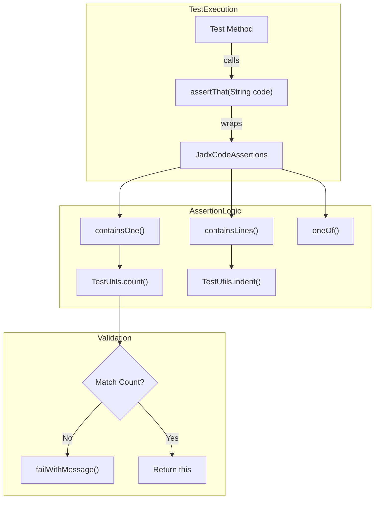
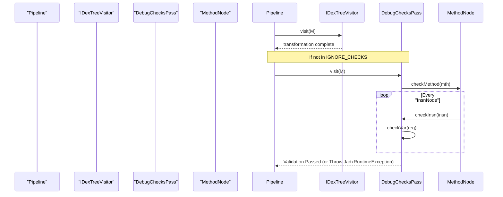
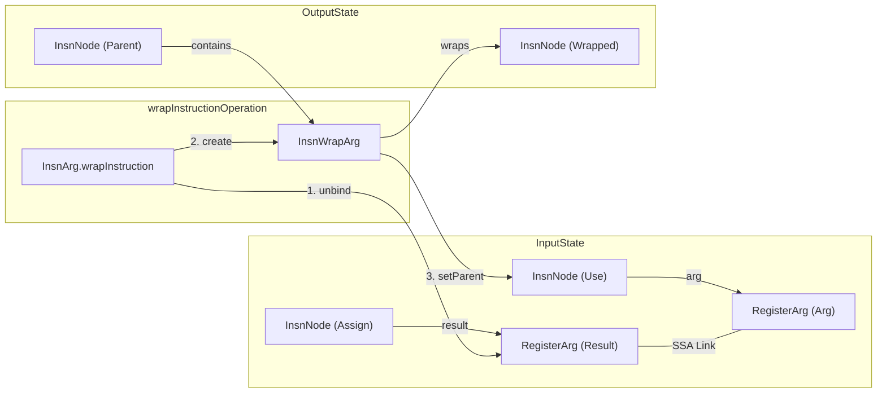

# Test Utilities and Assertions

Relevant source files

The following files were used as context for generating this wiki page:

- [jadx-core/src/main/java/jadx/core/dex/instructions/args/InsnArg.java](https://github.com/skylot/jadx/blob/HEAD/jadx-core/src/main/java/jadx/core/dex/instructions/args/InsnArg.java)
- [jadx-core/src/main/java/jadx/core/dex/instructions/args/InsnWrapArg.java](https://github.com/skylot/jadx/blob/HEAD/jadx-core/src/main/java/jadx/core/dex/instructions/args/InsnWrapArg.java)
- [jadx-core/src/main/java/jadx/core/dex/nodes/InsnNode.java](https://github.com/skylot/jadx/blob/HEAD/jadx-core/src/main/java/jadx/core/dex/nodes/InsnNode.java)
- [jadx-core/src/main/java/jadx/core/dex/nodes/ProcessState.java](https://github.com/skylot/jadx/blob/HEAD/jadx-core/src/main/java/jadx/core/dex/nodes/ProcessState.java)
- [jadx-core/src/main/java/jadx/core/dex/visitors/ConstInlineVisitor.java](https://github.com/skylot/jadx/blob/HEAD/jadx-core/src/main/java/jadx/core/dex/visitors/ConstInlineVisitor.java)
- [jadx-core/src/main/java/jadx/core/dex/visitors/PrepareForCodeGen.java](https://github.com/skylot/jadx/blob/HEAD/jadx-core/src/main/java/jadx/core/dex/visitors/PrepareForCodeGen.java)
- [jadx-core/src/main/java/jadx/core/dex/visitors/SimplifyVisitor.java](https://github.com/skylot/jadx/blob/HEAD/jadx-core/src/main/java/jadx/core/dex/visitors/SimplifyVisitor.java)
- [jadx-core/src/main/java/jadx/core/dex/visitors/regions/TernaryMod.java](https://github.com/skylot/jadx/blob/HEAD/jadx-core/src/main/java/jadx/core/dex/visitors/regions/TernaryMod.java)
- [jadx-core/src/main/java/jadx/core/dex/visitors/shrink/CodeShrinkVisitor.java](https://github.com/skylot/jadx/blob/HEAD/jadx-core/src/main/java/jadx/core/dex/visitors/shrink/CodeShrinkVisitor.java)
- [jadx-core/src/main/java/jadx/core/utils/DebugChecks.java](https://github.com/skylot/jadx/blob/HEAD/jadx-core/src/main/java/jadx/core/utils/DebugChecks.java)
- [jadx-core/src/main/java/jadx/core/utils/InsnRemover.java](https://github.com/skylot/jadx/blob/HEAD/jadx-core/src/main/java/jadx/core/utils/InsnRemover.java)
- [jadx-core/src/main/java/jadx/core/xmlgen/IResTableParser.java](https://github.com/skylot/jadx/blob/HEAD/jadx-core/src/main/java/jadx/core/xmlgen/IResTableParser.java)
- [jadx-core/src/test/java/jadx/api/JadxArgsValidatorOutDirsTest.java](https://github.com/skylot/jadx/blob/HEAD/jadx-core/src/test/java/jadx/api/JadxArgsValidatorOutDirsTest.java)
- [jadx-core/src/test/java/jadx/api/JadxDecompilerTest.java](https://github.com/skylot/jadx/blob/HEAD/jadx-core/src/test/java/jadx/api/JadxDecompilerTest.java)
- [jadx-core/src/test/java/jadx/tests/api/utils/assertj/JadxCodeAssertions.java](https://github.com/skylot/jadx/blob/HEAD/jadx-core/src/test/java/jadx/tests/api/utils/assertj/JadxCodeAssertions.java)
- [jadx-core/src/test/java/jadx/tests/integration/conditions/TestConditions14.java](https://github.com/skylot/jadx/blob/HEAD/jadx-core/src/test/java/jadx/tests/integration/conditions/TestConditions14.java)
- [jadx-core/src/test/java/jadx/tests/integration/enums/TestEnums2.java](https://github.com/skylot/jadx/blob/HEAD/jadx-core/src/test/java/jadx/tests/integration/enums/TestEnums2.java)
- [jadx-core/src/test/java/jadx/tests/integration/enums/TestEnumsInterface.java](https://github.com/skylot/jadx/blob/HEAD/jadx-core/src/test/java/jadx/tests/integration/enums/TestEnumsInterface.java)
- [jadx-core/src/test/java/jadx/tests/integration/others/TestClassReGen.java](https://github.com/skylot/jadx/blob/HEAD/jadx-core/src/test/java/jadx/tests/integration/others/TestClassReGen.java)
- [jadx-core/src/test/java/jadx/tests/integration/rename/TestAnonymousInline.java](https://github.com/skylot/jadx/blob/HEAD/jadx-core/src/test/java/jadx/tests/integration/rename/TestAnonymousInline.java)
- [jadx-core/src/test/java/jadx/tests/integration/rename/TestConstReplace.java](https://github.com/skylot/jadx/blob/HEAD/jadx-core/src/test/java/jadx/tests/integration/rename/TestConstReplace.java)
- [jadx-core/src/test/java/jadx/tests/integration/rename/TestFieldWithGenericRename.java](https://github.com/skylot/jadx/blob/HEAD/jadx-core/src/test/java/jadx/tests/integration/rename/TestFieldWithGenericRename.java)
- [jadx-core/src/test/java/jadx/tests/integration/rename/TestRenameEnum.java](https://github.com/skylot/jadx/blob/HEAD/jadx-core/src/test/java/jadx/tests/integration/rename/TestRenameEnum.java)
- [jadx-core/src/test/java/jadx/tests/integration/switches/TestSwitchOverStrings.java](https://github.com/skylot/jadx/blob/HEAD/jadx-core/src/test/java/jadx/tests/integration/switches/TestSwitchOverStrings.java)
- [jadx-core/src/test/java/jadx/tests/integration/variables/TestVariables8.java](https://github.com/skylot/jadx/blob/HEAD/jadx-core/src/test/java/jadx/tests/integration/variables/TestVariables8.java)
- [jadx-core/src/test/smali/variables/TestVariables8.smali](https://github.com/skylot/jadx/blob/HEAD/jadx-core/src/test/smali/variables/TestVariables8.smali)
- [jadx-plugins/jadx-aab-input/src/main/java/jadx/plugins/input/aab/AabInputPlugin.java](https://github.com/skylot/jadx/blob/HEAD/jadx-plugins/jadx-aab-input/src/main/java/jadx/plugins/input/aab/AabInputPlugin.java)
- [jadx-plugins/jadx-aab-input/src/main/java/jadx/plugins/input/aab/factories/ProtoAppDependenciesResContainerFactory.java](https://github.com/skylot/jadx/blob/HEAD/jadx-plugins/jadx-aab-input/src/main/java/jadx/plugins/input/aab/factories/ProtoAppDependenciesResContainerFactory.java)
- [jadx-plugins/jadx-aab-input/src/main/java/jadx/plugins/input/aab/factories/ProtoAssetsConfigResContainerFactory.java](https://github.com/skylot/jadx/blob/HEAD/jadx-plugins/jadx-aab-input/src/main/java/jadx/plugins/input/aab/factories/ProtoAssetsConfigResContainerFactory.java)
- [jadx-plugins/jadx-aab-input/src/main/java/jadx/plugins/input/aab/factories/ProtoNativeConfigResContainerFactory.java](https://github.com/skylot/jadx/blob/HEAD/jadx-plugins/jadx-aab-input/src/main/java/jadx/plugins/input/aab/factories/ProtoNativeConfigResContainerFactory.java)
- [jadx-plugins/jadx-aab-input/src/main/java/jadx/plugins/input/aab/factories/ProtoTableResContainerFactory.java](https://github.com/skylot/jadx/blob/HEAD/jadx-plugins/jadx-aab-input/src/main/java/jadx/plugins/input/aab/factories/ProtoTableResContainerFactory.java)
- [jadx-plugins/jadx-aab-input/src/main/java/jadx/plugins/input/aab/parsers/ResTableProtoParser.java](https://github.com/skylot/jadx/blob/HEAD/jadx-plugins/jadx-aab-input/src/main/java/jadx/plugins/input/aab/parsers/ResTableProtoParser.java)

This page documents the specialized infrastructure JADX uses to ensure decompilation quality, maintain internal IR (Intermediate Representation) consistency, and provide a fluent interface for writing integration tests.

## JadxCodeAssertions

`JadxCodeAssertions` is a fluent assertion engine built on top of AssertJ, specifically designed for verifying decompiled Java source code. It allows tests to check for the presence, absence, and frequency of specific code patterns without requiring complex regex or manual string searching.

### Key Assertion Methods
- **`containsOne(String substring)`**: Asserts that the decompiled code contains exactly one occurrence of the provided string [jadx-core/src/test/java/jadx/tests/api/utils/assertj/JadxCodeAssertions.java:25-27](https://github.com/skylot/jadx/blob/HEAD/jadx-core/src/test/java/jadx/tests/api/utils/assertj/JadxCodeAssertions.java#L25-L27).
- **`countString(int count, String substring)`**: Verifies that a substring appears a specific number of times [jadx-core/src/test/java/jadx/tests/api/utils/assertj/JadxCodeAssertions.java:29-36](https://github.com/skylot/jadx/blob/HEAD/jadx-core/src/test/java/jadx/tests/api/utils/assertj/JadxCodeAssertions.java#L29-L36).
- **`containsLine(int indent, String line)`**: Checks for a specific line at a specific indentation level [jadx-core/src/test/java/jadx/tests/api/utils/assertj/JadxCodeAssertions.java:42-44](https://github.com/skylot/jadx/blob/HEAD/jadx-core/src/test/java/jadx/tests/api/utils/assertj/JadxCodeAssertions.java#L42-L44).
- **`containsLines(int commonIndent, String... lines)`**: Validates a block of code while automatically handling indentation logic [jadx-core/src/test/java/jadx/tests/api/utils/assertj/JadxCodeAssertions.java:55-73](https://github.com/skylot/jadx/blob/HEAD/jadx-core/src/test/java/jadx/tests/api/utils/assertj/JadxCodeAssertions.java#L55-L73).
- **`doesNotContainSubsequence(CharSequence... values)`**: Ensures that a sequence of strings does not appear in the code in the specified order, useful for verifying that certain instruction sequences were correctly simplified or reordered [jadx-core/src/test/java/jadx/tests/api/utils/assertj/JadxCodeAssertions.java:75-88](https://github.com/skylot/jadx/blob/HEAD/jadx-core/src/test/java/jadx/tests/api/utils/assertj/JadxCodeAssertions.java#L75-L88).
- **`oneOf(Function<JadxCodeAssertions, JadxCodeAssertions>... checks)`**: A higher-order assertion that passes if exactly one of the provided assertion lambdas succeeds [jadx-core/src/test/java/jadx/tests/api/utils/assertj/JadxCodeAssertions.java:124-141](https://github.com/skylot/jadx/blob/HEAD/jadx-core/src/test/java/jadx/tests/api/utils/assertj/JadxCodeAssertions.java#L124-L141).

### Data Flow: Code to Assertion
The following diagram shows how decompiled code is wrapped into the assertion fluent API.

**Code Assertion Workflow**

**Sources:** [jadx-core/src/test/java/jadx/tests/api/utils/assertj/JadxCodeAssertions.java:17-36](https://github.com/skylot/jadx/blob/HEAD/jadx-core/src/test/java/jadx/tests/api/utils/assertj/JadxCodeAssertions.java#L17-L36), [jadx-core/src/test/java/jadx/tests/api/utils/assertj/JadxCodeAssertions.java:46-50](https://github.com/skylot/jadx/blob/HEAD/jadx-core/src/test/java/jadx/tests/api/utils/assertj/JadxCodeAssertions.java#L46-L50)

---

## DebugChecks and SSA Consistency

`DebugChecks` is a diagnostic utility used primarily during development and testing to validate the integrity of the Intermediate Representation (IR). It performs expensive checks on Static Single Assignment (SSA) variables, instruction wrapping, and block successors.

### Invariant Validation
The `checkMethod` function [jadx-core/src/main/java/jadx/core/utils/DebugChecks.java:59-72](https://github.com/skylot/jadx/blob/HEAD/jadx-core/src/main/java/jadx/core/utils/DebugChecks.java#L59-L72) iterates through all basic blocks and instructions to ensure:
1. **Instruction Result Consistency**: Every `InsnNode` result must be correctly linked to its `SSAVar` [jadx-core/src/main/java/jadx/core/utils/DebugChecks.java:75-77](https://github.com/skylot/jadx/blob/HEAD/jadx-core/src/main/java/jadx/core/utils/DebugChecks.java#L75-L77).
2. **Argument Integrity**: Wrapped instructions (`InsnWrapArg`) must not be marked with `AFlag.DONT_GENERATE` if the outer instruction is meant to be generated [jadx-core/src/main/java/jadx/core/utils/DebugChecks.java:83-87](https://github.com/skylot/jadx/blob/HEAD/jadx-core/src/main/java/jadx/core/utils/DebugChecks.java#L83-L87).
3. **SSA Variable Usage**: Every usage of an `SSAVar` must be present in the method's global SSA variable list, and the `useList` in the `SSAVar` must accurately reflect all instructions using that variable [jadx-core/src/main/java/jadx/core/utils/DebugChecks.java:146-162](https://github.com/skylot/jadx/blob/HEAD/jadx-core/src/main/java/jadx/core/utils/DebugChecks.java#L146-L162).
4. **Control Flow Graph (CFG) Sanity**: For `IfNode` instructions, the block must have exactly two successors (excluding temporary edges marked with `AType.TMP_EDGE`) [jadx-core/src/main/java/jadx/core/utils/DebugChecks.java:102-112](https://github.com/skylot/jadx/blob/HEAD/jadx-core/src/main/java/jadx/core/utils/DebugChecks.java#L102-L112).

### Integration in Visitor Pipeline
JADX can inject `DebugChecks` as a "pass" between every other visitor in the pipeline using `insertPasses` [jadx-core/src/main/java/jadx/core/utils/DebugChecks.java:38-49](https://github.com/skylot/jadx/blob/HEAD/jadx-core/src/main/java/jadx/core/utils/DebugChecks.java#L38-L49). This allows developers to pinpoint exactly which transformation pass corrupted the IR.

**DebugChecks Pipeline Integration**

**Sources:** [jadx-core/src/main/java/jadx/core/utils/DebugChecks.java:31-57](https://github.com/skylot/jadx/blob/HEAD/jadx-core/src/main/java/jadx/core/utils/DebugChecks.java#L31-L57), [jadx-core/src/main/java/jadx/core/utils/DebugChecks.java:133-166](https://github.com/skylot/jadx/blob/HEAD/jadx-core/src/main/java/jadx/core/utils/DebugChecks.java#L133-L166)

---

## Instruction Manipulation Utilities

During testing and optimization passes (like `SimplifyVisitor` or `ConstInlineVisitor`), JADX relies on `InsnRemover` to safely modify the IR without leaving dangling SSA references.

### Safe Instruction Removal
`InsnRemover` ensures that when an instruction is removed:
1. **Unbinding Arguments**: All arguments are "unbound," meaning their `SSAVar` usage counts are decremented via `unbindArgUsage` [jadx-core/src/main/java/jadx/core/utils/InsnRemover.java:106-109](https://github.com/skylot/jadx/blob/HEAD/jadx-core/src/main/java/jadx/core/utils/InsnRemover.java#L106-L109).
2. **Result Cleanup**: The result `RegisterArg` is cleared, and if the associated `SSAVar` has no remaining assignments or usages, it is removed from the `MethodNode` [jadx-core/src/main/java/jadx/core/utils/InsnRemover.java:121-133](https://github.com/skylot/jadx/blob/HEAD/jadx-core/src/main/java/jadx/core/utils/InsnRemover.java#L121-L133).
3. **SSA Var Removal Logic**: `removeSsaVar` checks if all usage is only in `PHI` instructions or `DONT_GENERATE` instructions before final removal [jadx-core/src/main/java/jadx/core/utils/InsnRemover.java:135-165](https://github.com/skylot/jadx/blob/HEAD/jadx-core/src/main/java/jadx/core/utils/InsnRemover.java#L135-L165).

### Instruction Wrapping
The `InsnArg.wrapInstruction` method is a critical utility for the `CodeShrinkVisitor` [jadx-core/src/main/java/jadx/core/dex/visitors/shrink/CodeShrinkVisitor.java:212-218](https://github.com/skylot/jadx/blob/HEAD/jadx-core/src/main/java/jadx/core/dex/visitors/shrink/CodeShrinkVisitor.java#L212-L218) and `SimplifyVisitor` [jadx-core/src/main/java/jadx/core/dex/visitors/SimplifyVisitor.java:117-120](https://github.com/skylot/jadx/blob/HEAD/jadx-core/src/main/java/jadx/core/dex/visitors/SimplifyVisitor.java#L117-L120). It transforms a standalone instruction into an `InsnWrapArg` and embeds it into a parent instruction, effectively inlining variables.

**Instruction Wrapping Data Flow**

**Sources:** [jadx-core/src/main/java/jadx/core/dex/instructions/args/InsnArg.java:100-152](https://github.com/skylot/jadx/blob/HEAD/jadx-core/src/main/java/jadx/core/dex/instructions/args/InsnArg.java#L100-L152), [jadx-core/src/main/java/jadx/core/utils/InsnRemover.java:91-104](https://github.com/skylot/jadx/blob/HEAD/jadx-core/src/main/java/jadx/core/utils/InsnRemover.java#L91-L104), [jadx-core/src/main/java/jadx/core/dex/nodes/InsnNode.java:300-307](https://github.com/skylot/jadx/blob/HEAD/jadx-core/src/main/java/jadx/core/dex/nodes/InsnNode.java#L300-L307)

---

## External Test Infrastructure

Tests such as `JadxDecompilerTest` verify the high-level API and the interaction between the decompiler and various input formats.

### High-Level API Testing
- **Example Usage**: `testExampleUsage` validates that `JadxDecompiler` can load an APK, save the output, and retrieve decompiled code for each `JavaClass` [jadx-core/src/test/java/jadx/api/JadxDecompilerTest.java:26-47](https://github.com/skylot/jadx/blob/HEAD/jadx-core/src/test/java/jadx/api/JadxDecompilerTest.java#L26-L47).
- **Direct Input**: `testDirectDexInput` demonstrates loading DEX data directly from an `InputStream` using the `DexInputPlugin` [jadx-core/src/test/java/jadx/api/JadxDecompilerTest.java:50-61](https://github.com/skylot/jadx/blob/HEAD/jadx-core/src/test/java/jadx/api/JadxDecompilerTest.java#L50-L61).
- **Resource Loading**: `testResourcesLoad` verifies the extraction and parsing of binary XML resources like `colors.xml` [jadx-core/src/test/java/jadx/api/JadxDecompilerTest.java:64-86](https://github.com/skylot/jadx/blob/HEAD/jadx-core/src/test/java/jadx/api/JadxDecompilerTest.java#L64-L86).

### SSA Variable Lifecycle
The interaction between `SSAVar` and instructions is critical during the transformation passes.

| Class | Role | Key Function |
|-------|------|--------------|
| `SSAVar` | Represents a single version of a register | `getUseList()` [jadx-core/src/main/java/jadx/core/dex/instructions/args/SSAVar.java:101](https://github.com/skylot/jadx/blob/HEAD/jadx-core/src/main/java/jadx/core/dex/instructions/args/SSAVar.java#L101) |
| `InsnNode` | Base instruction container | `visitInsns(Consumer)` [jadx-core/src/main/java/jadx/core/dex/nodes/InsnNode.java:300](https://github.com/skylot/jadx/blob/HEAD/jadx-core/src/main/java/jadx/core/dex/nodes/InsnNode.java#L300) |
| `RegisterArg` | Reference to a register in an instruction | `getSVar()` [jadx-core/src/main/java/jadx/core/dex/instructions/args/RegisterArg.java:44](https://github.com/skylot/jadx/blob/HEAD/jadx-core/src/main/java/jadx/core/dex/instructions/args/RegisterArg.java#L44) |

**Sources:** [jadx-core/src/test/java/jadx/api/JadxDecompilerTest.java:20-86](https://github.com/skylot/jadx/blob/HEAD/jadx-core/src/test/java/jadx/api/JadxDecompilerTest.java#L20-L86), [jadx-core/src/main/java/jadx/core/dex/nodes/InsnNode.java:28-63](https://github.com/skylot/jadx/blob/HEAD/jadx-core/src/main/java/jadx/core/dex/nodes/InsnNode.java#L28-L63)