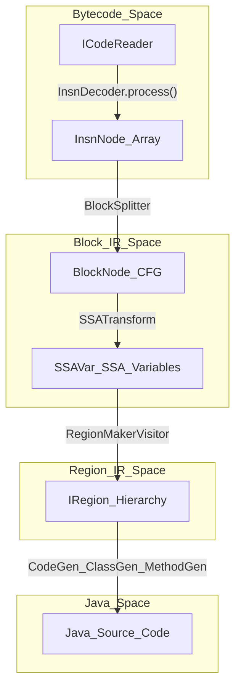
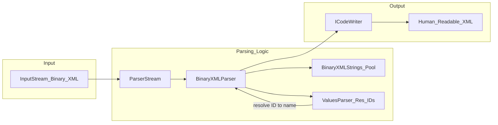
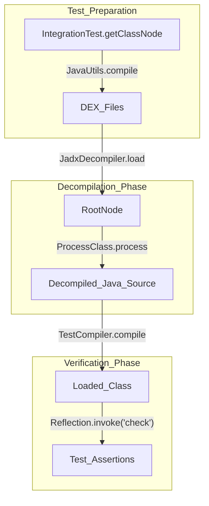

# Glossary

Relevant source files

The following files were used as context for generating this wiki page:

- [README.md](https://github.com/skylot/jadx/blob/HEAD/README.md)
- [jadx-cli/src/main/java/jadx/cli/JCommanderWrapper.java](https://github.com/skylot/jadx/blob/HEAD/jadx-cli/src/main/java/jadx/cli/JCommanderWrapper.java)
- [jadx-cli/src/main/java/jadx/cli/JadxCLI.java](https://github.com/skylot/jadx/blob/HEAD/jadx-cli/src/main/java/jadx/cli/JadxCLI.java)
- [jadx-cli/src/main/java/jadx/cli/JadxCLIArgs.java](https://github.com/skylot/jadx/blob/HEAD/jadx-cli/src/main/java/jadx/cli/JadxCLIArgs.java)
- [jadx-cli/src/main/java/jadx/cli/LogHelper.java](https://github.com/skylot/jadx/blob/HEAD/jadx-cli/src/main/java/jadx/cli/LogHelper.java)
- [jadx-cli/src/test/java/jadx/cli/JadxCLIArgsTest.java](https://github.com/skylot/jadx/blob/HEAD/jadx-cli/src/test/java/jadx/cli/JadxCLIArgsTest.java)
- [jadx-core/src/main/java/jadx/api/JadxArgs.java](https://github.com/skylot/jadx/blob/HEAD/jadx-core/src/main/java/jadx/api/JadxArgs.java)
- [jadx-core/src/main/java/jadx/api/JadxDecompiler.java](https://github.com/skylot/jadx/blob/HEAD/jadx-core/src/main/java/jadx/api/JadxDecompiler.java)
- [jadx-core/src/main/java/jadx/api/JavaClass.java](https://github.com/skylot/jadx/blob/HEAD/jadx-core/src/main/java/jadx/api/JavaClass.java)
- [jadx-core/src/main/java/jadx/api/JavaField.java](https://github.com/skylot/jadx/blob/HEAD/jadx-core/src/main/java/jadx/api/JavaField.java)
- [jadx-core/src/main/java/jadx/api/JavaMethod.java](https://github.com/skylot/jadx/blob/HEAD/jadx-core/src/main/java/jadx/api/JavaMethod.java)
- [jadx-core/src/main/java/jadx/core/Jadx.java](https://github.com/skylot/jadx/blob/HEAD/jadx-core/src/main/java/jadx/core/Jadx.java)
- [jadx-core/src/main/java/jadx/core/ProcessClass.java](https://github.com/skylot/jadx/blob/HEAD/jadx-core/src/main/java/jadx/core/ProcessClass.java)
- [jadx-core/src/main/java/jadx/core/codegen/ClassGen.java](https://github.com/skylot/jadx/blob/HEAD/jadx-core/src/main/java/jadx/core/codegen/ClassGen.java)
- [jadx-core/src/main/java/jadx/core/codegen/InsnGen.java](https://github.com/skylot/jadx/blob/HEAD/jadx-core/src/main/java/jadx/core/codegen/InsnGen.java)
- [jadx-core/src/main/java/jadx/core/codegen/MethodGen.java](https://github.com/skylot/jadx/blob/HEAD/jadx-core/src/main/java/jadx/core/codegen/MethodGen.java)
- [jadx-core/src/main/java/jadx/core/codegen/NameGen.java](https://github.com/skylot/jadx/blob/HEAD/jadx-core/src/main/java/jadx/core/codegen/NameGen.java)
- [jadx-core/src/main/java/jadx/core/codegen/RegionGen.java](https://github.com/skylot/jadx/blob/HEAD/jadx-core/src/main/java/jadx/core/codegen/RegionGen.java)
- [jadx-core/src/main/java/jadx/core/codegen/SimpleModeHelper.java](https://github.com/skylot/jadx/blob/HEAD/jadx-core/src/main/java/jadx/core/codegen/SimpleModeHelper.java)
- [jadx-core/src/main/java/jadx/core/dex/attributes/AFlag.java](https://github.com/skylot/jadx/blob/HEAD/jadx-core/src/main/java/jadx/core/dex/attributes/AFlag.java)
- [jadx-core/src/main/java/jadx/core/dex/info/ClassInfo.java](https://github.com/skylot/jadx/blob/HEAD/jadx-core/src/main/java/jadx/core/dex/info/ClassInfo.java)
- [jadx-core/src/main/java/jadx/core/dex/instructions/InsnDecoder.java](https://github.com/skylot/jadx/blob/HEAD/jadx-core/src/main/java/jadx/core/dex/instructions/InsnDecoder.java)
- [jadx-core/src/main/java/jadx/core/dex/instructions/PhiInsn.java](https://github.com/skylot/jadx/blob/HEAD/jadx-core/src/main/java/jadx/core/dex/instructions/PhiInsn.java)
- [jadx-core/src/main/java/jadx/core/dex/instructions/args/ArgType.java](https://github.com/skylot/jadx/blob/HEAD/jadx-core/src/main/java/jadx/core/dex/instructions/args/ArgType.java)
- [jadx-core/src/main/java/jadx/core/dex/instructions/args/SSAVar.java](https://github.com/skylot/jadx/blob/HEAD/jadx-core/src/main/java/jadx/core/dex/instructions/args/SSAVar.java)
- [jadx-core/src/main/java/jadx/core/dex/nodes/BlockNode.java](https://github.com/skylot/jadx/blob/HEAD/jadx-core/src/main/java/jadx/core/dex/nodes/BlockNode.java)
- [jadx-core/src/main/java/jadx/core/dex/nodes/ClassNode.java](https://github.com/skylot/jadx/blob/HEAD/jadx-core/src/main/java/jadx/core/dex/nodes/ClassNode.java)
- [jadx-core/src/main/java/jadx/core/dex/nodes/MethodNode.java](https://github.com/skylot/jadx/blob/HEAD/jadx-core/src/main/java/jadx/core/dex/nodes/MethodNode.java)
- [jadx-core/src/main/java/jadx/core/dex/nodes/RootNode.java](https://github.com/skylot/jadx/blob/HEAD/jadx-core/src/main/java/jadx/core/dex/nodes/RootNode.java)
- [jadx-core/src/main/java/jadx/core/dex/visitors/ClassModifier.java](https://github.com/skylot/jadx/blob/HEAD/jadx-core/src/main/java/jadx/core/dex/visitors/ClassModifier.java)
- [jadx-core/src/main/java/jadx/core/dex/visitors/DotGraphVisitor.java](https://github.com/skylot/jadx/blob/HEAD/jadx-core/src/main/java/jadx/core/dex/visitors/DotGraphVisitor.java)
- [jadx-core/src/main/java/jadx/core/dex/visitors/InitCodeVariables.java](https://github.com/skylot/jadx/blob/HEAD/jadx-core/src/main/java/jadx/core/dex/visitors/InitCodeVariables.java)
- [jadx-core/src/main/java/jadx/core/dex/visitors/ModVisitor.java](https://github.com/skylot/jadx/blob/HEAD/jadx-core/src/main/java/jadx/core/dex/visitors/ModVisitor.java)
- [jadx-core/src/main/java/jadx/core/dex/visitors/blocks/BlockExceptionHandler.java](https://github.com/skylot/jadx/blob/HEAD/jadx-core/src/main/java/jadx/core/dex/visitors/blocks/BlockExceptionHandler.java)
- [jadx-core/src/main/java/jadx/core/dex/visitors/blocks/BlockProcessor.java](https://github.com/skylot/jadx/blob/HEAD/jadx-core/src/main/java/jadx/core/dex/visitors/blocks/BlockProcessor.java)
- [jadx-core/src/main/java/jadx/core/dex/visitors/blocks/BlockSplitter.java](https://github.com/skylot/jadx/blob/HEAD/jadx-core/src/main/java/jadx/core/dex/visitors/blocks/BlockSplitter.java)
- [jadx-core/src/main/java/jadx/core/dex/visitors/blocks/DominatorTree.java](https://github.com/skylot/jadx/blob/HEAD/jadx-core/src/main/java/jadx/core/dex/visitors/blocks/DominatorTree.java)
- [jadx-core/src/main/java/jadx/core/dex/visitors/debuginfo/DebugInfoApplyVisitor.java](https://github.com/skylot/jadx/blob/HEAD/jadx-core/src/main/java/jadx/core/dex/visitors/debuginfo/DebugInfoApplyVisitor.java)
- [jadx-core/src/main/java/jadx/core/dex/visitors/typeinference/TypeInferenceVisitor.java](https://github.com/skylot/jadx/blob/HEAD/jadx-core/src/main/java/jadx/core/dex/visitors/typeinference/TypeInferenceVisitor.java)
- [jadx-core/src/main/java/jadx/core/dex/visitors/typeinference/TypeSearch.java](https://github.com/skylot/jadx/blob/HEAD/jadx-core/src/main/java/jadx/core/dex/visitors/typeinference/TypeSearch.java)
- [jadx-core/src/main/java/jadx/core/dex/visitors/typeinference/TypeUpdate.java](https://github.com/skylot/jadx/blob/HEAD/jadx-core/src/main/java/jadx/core/dex/visitors/typeinference/TypeUpdate.java)
- [jadx-core/src/main/java/jadx/core/dex/visitors/typeinference/TypeUpdateFlags.java](https://github.com/skylot/jadx/blob/HEAD/jadx-core/src/main/java/jadx/core/dex/visitors/typeinference/TypeUpdateFlags.java)
- [jadx-core/src/main/java/jadx/core/utils/BlockUtils.java](https://github.com/skylot/jadx/blob/HEAD/jadx-core/src/main/java/jadx/core/utils/BlockUtils.java)
- [jadx-core/src/main/java/jadx/core/utils/DebugUtils.java](https://github.com/skylot/jadx/blob/HEAD/jadx-core/src/main/java/jadx/core/utils/DebugUtils.java)
- [jadx-core/src/main/java/jadx/core/utils/android/AndroidResourcesUtils.java](https://github.com/skylot/jadx/blob/HEAD/jadx-core/src/main/java/jadx/core/utils/android/AndroidResourcesUtils.java)
- [jadx-core/src/main/java/jadx/core/utils/files/FileUtils.java](https://github.com/skylot/jadx/blob/HEAD/jadx-core/src/main/java/jadx/core/utils/files/FileUtils.java)
- [jadx-core/src/main/java/jadx/core/xmlgen/BinaryXMLParser.java](https://github.com/skylot/jadx/blob/HEAD/jadx-core/src/main/java/jadx/core/xmlgen/BinaryXMLParser.java)
- [jadx-core/src/test/java/jadx/tests/api/IntegrationTest.java](https://github.com/skylot/jadx/blob/HEAD/jadx-core/src/test/java/jadx/tests/api/IntegrationTest.java)
- [jadx-core/src/test/java/jadx/tests/integration/conditions/TestTernary4.java](https://github.com/skylot/jadx/blob/HEAD/jadx-core/src/test/java/jadx/tests/integration/conditions/TestTernary4.java)
- [jadx-core/src/test/java/jadx/tests/integration/generics/TestMissingGenericsTypes2.java](https://github.com/skylot/jadx/blob/HEAD/jadx-core/src/test/java/jadx/tests/integration/generics/TestMissingGenericsTypes2.java)
- [jadx-core/src/test/java/jadx/tests/integration/trycatch/TestTryCatch10.java](https://github.com/skylot/jadx/blob/HEAD/jadx-core/src/test/java/jadx/tests/integration/trycatch/TestTryCatch10.java)
- [jadx-core/src/test/java/jadx/tests/integration/types/TestTypeResolver3.java](https://github.com/skylot/jadx/blob/HEAD/jadx-core/src/test/java/jadx/tests/integration/types/TestTypeResolver3.java)
- [jadx-core/src/test/java/jadx/tests/integration/variables/TestVariablesDeclAnnotation.java](https://github.com/skylot/jadx/blob/HEAD/jadx-core/src/test/java/jadx/tests/integration/variables/TestVariablesDeclAnnotation.java)
- [jadx-core/src/test/java/jadx/tests/integration/variables/TestVariablesInLoop.java](https://github.com/skylot/jadx/blob/HEAD/jadx-core/src/test/java/jadx/tests/integration/variables/TestVariablesInLoop.java)
- [jadx-core/src/test/smali/conditions/TestTernary4.smali](https://github.com/skylot/jadx/blob/HEAD/jadx-core/src/test/smali/conditions/TestTernary4.smali)
- [jadx-core/src/test/smali/generics/TestMissingGenericsTypes2.smali](https://github.com/skylot/jadx/blob/HEAD/jadx-core/src/test/smali/generics/TestMissingGenericsTypes2.smali)
- [jadx-core/src/test/smali/trycatch/TestTryCatch10.smali](https://github.com/skylot/jadx/blob/HEAD/jadx-core/src/test/smali/trycatch/TestTryCatch10.smali)
- [jadx-core/src/test/smali/variables/TestVariablesInLoop.smali](https://github.com/skylot/jadx/blob/HEAD/jadx-core/src/test/smali/variables/TestVariablesInLoop.smali)
- [jadx-gui/src/main/java/jadx/gui/JadxGUI.java](https://github.com/skylot/jadx/blob/HEAD/jadx-gui/src/main/java/jadx/gui/JadxGUI.java)
- [jadx-gui/src/main/java/jadx/gui/JadxWrapper.java](https://github.com/skylot/jadx/blob/HEAD/jadx-gui/src/main/java/jadx/gui/JadxWrapper.java)

This glossary defines codebase-specific terms, jargon, and domain concepts used within JADX. It serves as a technical reference for onboarding engineers to understand the internal nomenclature and how these concepts map to specific implementation details.

## Core Decompilation Concepts

### Node Hierarchy
JADX represents the structure of the input files using a hierarchical "Node" system. These nodes store both the structural data and the attributes discovered during the visitor pipeline.

| Term | Definition | Key Code Entity |
| :--- | :--- | :--- |
| **RootNode** | The central registry and entry point for a decompilation session. It holds global configuration, class maps, and resource storage. | [jadx-core/src/main/java/jadx/core/dex/nodes/RootNode.java:69-70](https://github.com/skylot/jadx/blob/HEAD/jadx-core/src/main/java/jadx/core/dex/nodes/RootNode.java#L69-L70) |
| **ClassNode** | Represents a single class. It contains methods, fields, and inner classes. It manages its own `ProcessState`. | [jadx-core/src/main/java/jadx/core/dex/nodes/ClassNode.java:59-60](https://github.com/skylot/jadx/blob/HEAD/jadx-core/src/main/java/jadx/core/dex/nodes/ClassNode.java#L59-L60) |
| **MethodNode** | Represents a method within a class. It contains the instructions, blocks, and final region structure. | [jadx-core/src/main/java/jadx/core/dex/nodes/MethodNode.java:51-52](https://github.com/skylot/jadx/blob/HEAD/jadx-core/src/main/java/jadx/core/dex/nodes/MethodNode.java#L51-L52) |
| **FieldNode** | Represents a field within a class. | [jadx-core/src/main/java/jadx/core/dex/nodes/FieldNode.java:16-17](https://github.com/skylot/jadx/blob/HEAD/jadx-core/src/main/java/jadx/core/dex/nodes/FieldNode.java#L16-L17) |

**Sources:** [jadx-core/src/main/java/jadx/core/dex/nodes/RootNode.java:69-81](https://github.com/skylot/jadx/blob/HEAD/jadx-core/src/main/java/jadx/core/dex/nodes/RootNode.java#L69-L81), [jadx-core/src/main/java/jadx/core/dex/nodes/ClassNode.java:59-87](https://github.com/skylot/jadx/blob/HEAD/jadx-core/src/main/java/jadx/core/dex/nodes/ClassNode.java#L59-L87), [jadx-core/src/main/java/jadx/core/dex/nodes/MethodNode.java:51-96](https://github.com/skylot/jadx/blob/HEAD/jadx-core/src/main/java/jadx/core/dex/nodes/MethodNode.java#L51-L96).

### IR (Intermediate Representation) Levels
JADX transforms code through several levels of abstraction, referred to as different IRs.

*   **Instructions IR**: The initial flat list of `InsnNode` objects decoded from bytecode by `InsnDecoder`.
*   **Blocks IR**: A Control Flow Graph (CFG) where instructions are grouped into `BlockNode` units connected by edges.
*   **Regions IR**: A hierarchical structure where blocks are grouped into high-level Java constructs (If, Loop, Try/Catch) represented by `IRegion`.

**IR Transformation Flow**

**Sources:** [jadx-core/src/main/java/jadx/core/Jadx.java:123-181](https://github.com/skylot/jadx/blob/HEAD/jadx-core/src/main/java/jadx/core/Jadx.java#L123-L181), [jadx-core/src/main/java/jadx/core/dex/nodes/MethodNode.java:171-177](https://github.com/skylot/jadx/blob/HEAD/jadx-core/src/main/java/jadx/core/dex/nodes/MethodNode.java#L171-L177), [jadx-core/src/main/java/jadx/core/dex/instructions/InsnDecoder.java:36-37](https://github.com/skylot/jadx/blob/HEAD/jadx-core/src/main/java/jadx/core/dex/instructions/InsnDecoder.java#L36-L37).

---

## Technical Jargon & Abbreviations

### SSA (Static Single Assignment)
A property of the IR where every variable is assigned exactly once. JADX performs an `SSATransform` to convert registers into `SSAVar` instances, which simplifies type inference and optimization passes.
*   **Implementation**: `SSATransform` is added to the visitor list in `Jadx.getRegionsModePasses`.
*   **Code Pointer**: [jadx-core/src/main/java/jadx/core/Jadx.java:145-145](https://github.com/skylot/jadx/blob/HEAD/jadx-core/src/main/java/jadx/core/Jadx.java#L145).

### Visitor Pipeline
The sequence of `IDexTreeVisitor` implementations that process the `RootNode`. Passes are divided into "Pre-Decompile" (global analysis) and "Decompile" (method-specific) stages.
*   **Orchestrator**: `ProcessClass` executes the pipeline for each class.
*   **Key Function**: [jadx-core/src/main/java/jadx/core/Jadx.java:90-102](https://github.com/skylot/jadx/blob/HEAD/jadx-core/src/main/java/jadx/core/Jadx.java#L90-L102) defines the lists of visitors based on `DecompilationMode`.

### Deobfuscation Alias
JADX distinguishes between the "Original Name" (from bytecode) and the "Alias" (the name that will appear in generated code). If deobfuscation is enabled, `NameMapper` generates new aliases for cryptic identifiers.
*   **Implementation**: `ClassInfo`, `MethodInfo`, and `FieldInfo` all provide alias management.
*   **Code Pointer**: [jadx-core/src/main/java/jadx/core/codegen/InsnGen.java:209-212](https://github.com/skylot/jadx/blob/HEAD/jadx-core/src/main/java/jadx/core/codegen/InsnGen.java#L209-L212) shows usage of aliases during code generation.

### Attribute Storage
A mechanism to attach metadata to any Node without changing the class structure. Attributes (e.g., `AFlag`, `AType`) signal to later passes or code generators that specific logic should be applied (e.g., `AFlag.DONT_GENERATE`).
*   **Base Class**: `NotificationAttrNode` (extended by `ClassNode`, `MethodNode`, etc.).
*   **Code Pointer**: [jadx-core/src/main/java/jadx/core/dex/nodes/ClassNode.java:59-60](https://github.com/skylot/jadx/blob/HEAD/jadx-core/src/main/java/jadx/core/dex/nodes/ClassNode.java#L59-L60).

**Sources:** [jadx-core/src/main/java/jadx/core/Jadx.java:90-120](https://github.com/skylot/jadx/blob/HEAD/jadx-core/src/main/java/jadx/core/Jadx.java#L90-L120), [jadx-core/src/main/java/jadx/core/dex/nodes/ClassNode.java:59-60](https://github.com/skylot/jadx/blob/HEAD/jadx-core/src/main/java/jadx/core/dex/nodes/ClassNode.java#L59-L60), [jadx-core/src/main/java/jadx/core/codegen/InsnGen.java:209-212](https://github.com/skylot/jadx/blob/HEAD/jadx-core/src/main/java/jadx/core/codegen/InsnGen.java#L209-L212).

---

## Domain Concepts

### Resource Processing
Android-specific decoding of binary files into human-readable formats.

| Term | Definition | Key Code Entity |
| :--- | :--- | :--- |
| **ARSC** | The `resources.arsc` file containing the resource table. | [jadx-core/src/main/java/jadx/core/xmlgen/ResourceStorage.java:1](https://github.com/skylot/jadx/blob/HEAD/jadx-core/src/main/java/jadx/core/xmlgen/ResourceStorage.java#L1) |
| **Binary XML** | Compiled XML format used in APKs (e.g., `AndroidManifest.xml`). | [jadx-core/src/main/java/jadx/core/xmlgen/BinaryXMLParser.java:26](https://github.com/skylot/jadx/blob/HEAD/jadx-core/src/main/java/jadx/core/xmlgen/BinaryXMLParser.java#L26) |
| **String Pool** | A block in binary XML or ARSC containing all unique strings. | [jadx-core/src/main/java/jadx/core/xmlgen/BinaryXMLStrings.java:1](https://github.com/skylot/jadx/blob/HEAD/jadx-core/src/main/java/jadx/core/xmlgen/BinaryXMLStrings.java#L1) |
| **ManifestAttributes** | Interprets Android-specific integer constants in the manifest. | [jadx-core/src/main/java/jadx/core/xmlgen/ManifestAttributes.java:1](https://github.com/skylot/jadx/blob/HEAD/jadx-core/src/main/java/jadx/core/xmlgen/ManifestAttributes.java#L1) |

**Resource Data Flow**

**Sources:** [jadx-core/src/main/java/jadx/core/xmlgen/BinaryXMLParser.java:26-43](https://github.com/skylot/jadx/blob/HEAD/jadx-core/src/main/java/jadx/core/xmlgen/BinaryXMLParser.java#L26-L43), [jadx-core/src/main/java/jadx/core/xmlgen/entry/ValuesParser.java:1](https://github.com/skylot/jadx/blob/HEAD/jadx-core/src/main/java/jadx/core/xmlgen/entry/ValuesParser.java#L1).

### Instruction Wrapping
The process of nesting instructions to create complex expressions. For example, converting `s1 = a + b; s2 = s1 * c;` into `(a + b) * c`.
*   **Entity**: `InsnWrapArg` is an argument that contains another `InsnNode`.
*   **Implementation**: [jadx-core/src/main/java/jadx/core/codegen/InsnGen.java:138-147](https://github.com/skylot/jadx/blob/HEAD/jadx-core/src/main/java/jadx/core/codegen/InsnGen.java#L138-L147).

### Fallback Mode
A decompilation mode that skips complex structural analysis (Region building) and outputs a linear representation of instructions with `goto` statements.
*   **Trigger**: User flag `--fallback` or a `JadxRuntimeException` during normal processing.
*   **Implementation**: [jadx-core/src/main/java/jadx/core/codegen/MethodGen.java:50-53](https://github.com/skylot/jadx/blob/HEAD/jadx-core/src/main/java/jadx/core/codegen/MethodGen.java#L50-L53), [jadx-core/src/main/java/jadx/core/dex/visitors/FallbackModeVisitor.java:1](https://github.com/skylot/jadx/blob/HEAD/jadx-core/src/main/java/jadx/core/dex/visitors/FallbackModeVisitor.java#L1).

**Sources:** [jadx-core/src/main/java/jadx/core/codegen/InsnGen.java:138-147](https://github.com/skylot/jadx/blob/HEAD/jadx-core/src/main/java/jadx/core/codegen/InsnGen.java#L138-L147), [jadx-core/src/main/java/jadx/core/codegen/MethodGen.java:50-53](https://github.com/skylot/jadx/blob/HEAD/jadx-core/src/main/java/jadx/core/codegen/MethodGen.java#L50-L53), [jadx-core/src/main/java/jadx/api/JadxDecompiler.java:109-117](https://github.com/skylot/jadx/blob/HEAD/jadx-core/src/main/java/jadx/api/JadxDecompiler.java#L109-L117).

### Integration Testing Infrastructure
The testing framework used to verify decompilation accuracy by compiling Java source, decompiling the resulting DEX, and executing assertions.

| Term | Definition | Key Code Entity |
| :--- | :--- | :--- |
| **IntegrationTest** | Base class for tests that automate the full compile-decompile-verify cycle. | [jadx-core/src/test/java/jadx/tests/api/IntegrationTest.java:85](https://github.com/skylot/jadx/blob/HEAD/jadx-core/src/test/java/jadx/tests/api/IntegrationTest.java#L85) |
| **check()** | A magic method name in test classes that is automatically executed by the test runner after decompilation. | [jadx-core/src/test/java/jadx/tests/api/IntegrationTest.java:105](https://github.com/skylot/jadx/blob/HEAD/jadx-core/src/test/java/jadx/tests/api/IntegrationTest.java#L105) |
| **JadxDecompiler** | The primary orchestrator for the library-mode usage, also used in tests to load files. | [jadx-core/src/main/java/jadx/api/JadxDecompiler.java:86](https://github.com/skylot/jadx/blob/HEAD/jadx-core/src/main/java/jadx/api/JadxDecompiler.java#L86) |

**Test Execution Flow**

**Sources:** [jadx-core/src/test/java/jadx/tests/api/IntegrationTest.java:85-132](https://github.com/skylot/jadx/blob/HEAD/jadx-core/src/test/java/jadx/tests/api/IntegrationTest.java#L85-L132), [jadx-core/src/main/java/jadx/api/JadxDecompiler.java:119-139](https://github.com/skylot/jadx/blob/HEAD/jadx-core/src/main/java/jadx/api/JadxDecompiler.java#L119-L139).